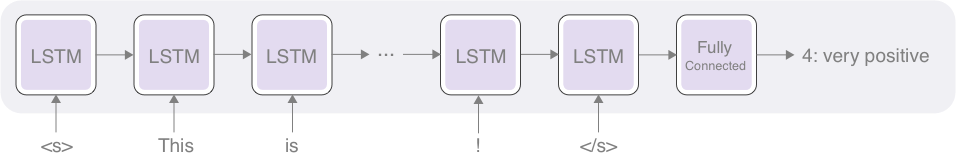

Title: Training a Sentiment Analyzer using AllenNLP (in less than 100 lines of Python code)
Date: 2018-10-13 00:00
Category: Sentiment Analysis 
Tags: Sentiment Analysis, AllenNLP
Cover: images/lstm_sst.png
slug: training-sentiment-analyzer-using-allennlp


## What is Sentiment Analysis?

Sentiment analysis is a popular text analytic technique used in the automatic identification and categorization of subjective information within text. The technique is widely used in quantifying opinions, emotions, etc. that are usually written in an unstructured way; and thus, hard to quantify otherwise. Sentiment analysis is applied to a wide variety of textual resources such as survey, reviews, social media posts, and so on. 

One of the most basic tasks in sentiment analysis is the classification of polarity, that is, to classify whether the expressed opinion is positive, negative, or neutral. There could be more than three classes, e.g., strongly positive, positive, neutral, negative, or strongly negative. This may sound familiar to you if used one of the websites (think: Amazon) where people can review things (products, movies, anything) using a 5-point scale expressed by the number of stars. 

## Stanford Sentiment TreeBank

There are several publicly available datasets for sentiment classification. In this post, we're going to use the [Stanford Sentiment TreeBank](https://nlp.stanford.edu/sentiment/), or abbreviated as SST, which is probably one of the most widely-used sentiment datasets as of today. One feature that differentiates SST from other datasets is the fact that sentiment labels are assigned not only to sentences but also to every phrase, and every word, in sentences. This enables us to study the complex semantic interactions between words and phrases. For example, let's consider the polarity of this sentence as a whole:

> This movie was actually neither that funny, nor super witty.

The above statement would definitely be a negative, although, if you focus on the individual words (such as *funny*, *witty*), you might be fooled to think it's a positive. A naive bag-of-words classifier which focuses solely on individual words would have difficulties classifying this example correctly. In order to correctly classify the polarity of this sentence, you need to understand the semantic impact of the negation "neither ... nor ...". For this property, SST has been used as the standard benchmark for neural network models that can capture the syntactic structures of sentence \[[Socher et al. 2013](https://nlp.stanford.edu/~socherr/EMNLP2013_RNTN.pdf)\].   


## PyTorch and AllenNLP

[PyTorch](https://pytorch.org/) is my favorite deep learning framework. It provides flexible, easy-to-write modules that you can run dynamically while being reasonably fast. The use of PyTorch within the research community [has exploded in the past year](https://www.reddit.com/r/MachineLearning/comments/9kys38/r_frameworks_mentioned_iclr_20182019_tensorflow/).

Although PyTorch is a very powerful framework, natural language processing often involves low-level, boilerplate chores, including, but not limited to: reading and writing datasets, tokenizing and indexing words, managing vocabulary, minibatching, sorting and padding, etc. Although correctly having such building blocks is crucial in NLP tasks, you will need to write similar design patterns again and again when you're iterating fast, which could be time-wasting. This is where libraries like AllenNLP proves reliable.

[AllenNLP](https://allennlp.org/) is an open-source NLP platform developed by the Allen Institute of Artificial Intelligence. It was designed to support quick iterations for NLP research and development, especially for semantic and language understanding tasks. It provides a flexible API, useful abstractions for NLP, and a modular experimental framework that accelerates NLP research. 

In this post, I'm going to show you a step-by-step guide of how to build your own sentiment classifier using AllenNLP. Because AllenNLP takes care of the low-level chores and provides the training framework, the entire script is [less than just 100 lines of Python code](https://github.com/mhagiwara/realworldnlp/blob/master/examples/sentiment/sst_classifier.py). If necessary, you could experiment with other network architectures quite easily. 

Go ahead and download the SST dataset. What you'll need is the dataset split into train, dev, and testsets in PTB tree format which can be downloaded from [this link](https://nlp.stanford.edu/sentiment/trainDevTestTrees_PTB.zip). We assume that those files are expanded under `data/stanfordSentimentTreebank/trees`. 

Note that in the code snippets below, we assume that you already `import`ed appropriate modules, classes, and methods. See the [full script](https://github.com/mhagiwara/realworldnlp/blob/master/examples/sentiment/sst_classifier.py) for more details. By the way, you'll notice that this script is very similar to the AllenNLP's [part-of-speech tagging tutorial](https://allennlp.org/tutorials). It is very easy to experiment with different models and tasks with little modification in AllenNLP.  


## Reading and Pre-Processing Dataset

AllenNLP already provides a handy dataset reader called `StanfordSentimentTreeBankDatasetReader` --- an interface for reading the SST dataset. You can read the dataset by specifying the path to the dataset files as the argument for the `read()` method as in: 

```Python
reader = StanfordSentimentTreeBankDatasetReader()

train_dataset = reader.read('data/stanfordSentimentTreebank/trees/train.txt')
dev_dataset = reader.read('data/stanfordSentimentTreebank/trees/dev.txt')

```

The first step in almost any deep NLP tasks is to specify how to convert textual data into tensors. This comprises a step in which words and labels (in this case, polarity labels such as positive and negative) are converted to integer IDs. In AllenNLP, this is automatically taken care of by `Vocabulary`, which stores the mapping from words/labels to IDs.  

```Python
# You can optionally specify the minimum count of tokens/labels.
# `min_count={'tokens':3}` here means that any tokens that appear less than three times
# will be ignored and not included in the vocabulary.
vocab = Vocabulary.from_instances(train_dataset + dev_dataset,
                                  min_count={'tokens': 3})
```

  
The next step in many deep NLP tasks is to convert words into an embedding. In deep learning, an embedding is a continuous vector representation of something that is usually discrete and high dimensional. You can use `Embedding` to create this mapping and use `BasicTextFieldEmbedder` to actually convert IDs into embedded vectors. 
 

```Python
token_embedding = Embedding(num_embeddings=vocab.get_vocab_size('tokens'),
                            embedding_dim=EMBEDDING_DIM)
# BasicTextFieldEmbedder takes a dict - we need an embedding just for tokens,
# not for labels, which are used unchanged as the answer of the sentence classification
word_embeddings = BasicTextFieldEmbedder({"tokens": token_embedding})
```


## Sentence Classification Model

<figure style="text-align: center">
	
	<figcaption>Figure: LSTM-RNN Sentence Classification Model</figcaption>
</figure>

Now, define our model that classifies a sentence into classes. The model is a standard LSTM-RNN plus a fully connected linear layer for classification. If this seems like a lot, don't worry, I've added extensive comments in the snippet:  

```Python
# Model in AllenNLP represents a model that is trained.
class LstmClassifier(Model):
    def __init__(self,
                 word_embeddings: TextFieldEmbedder,
                 encoder: Seq2VecEncoder,
                 vocab: Vocabulary) -> None:
        super().__init__(vocab)
        # We need the embeddings to convert word IDs to their vector representations
        self.word_embeddings = word_embeddings

        # Seq2VecEncoder is a neural network abstraction that takes a sequence of something
        # (usually a sequence of embedded word vectors), processes it, and returns it as a single
        # vector. Oftentimes, this is an RNN-based architecture (e.g., LSTM or GRU), but
        # AllenNLP also supports CNNs and other simple architectures (for example,
        # just averaging over the input vectors).
        self.encoder = encoder

        # After converting a sequence of vectors to a single vector, we feed it into
        # a fully-connected linear layer to reduce the dimension to the total number of labels.
        self.hidden2tag = torch.nn.Linear(in_features=encoder.get_output_dim(),
                                          out_features=vocab.get_vocab_size('labels'))
        self.accuracy = CategoricalAccuracy()

        # We use the cross-entropy loss because this is a classification task.
        # Note that PyTorch's CrossEntropyLoss combines softmax and log likelihood loss,
        # which makes it unnecessary to add a separate softmax layer.
        self.loss_function = torch.nn.CrossEntropyLoss()

    # Instances are fed to forward after batching.
    # Fields are passed through arguments with the same name.
    def forward(self,
                tokens: Dict[str, torch.Tensor],
                label: torch.Tensor = None) -> torch.Tensor:
        # In deep NLP, when sequences of tensors in different lengths are batched together,
        # shorter sequences get padded with zeros to make them of equal length.
        # Masking is the process to ignore extra zeros added by padding
        mask = get_text_field_mask(tokens)

        # Forward pass
        embeddings = self.word_embeddings(tokens)
        encoder_out = self.encoder(embeddings, mask)
        logits = self.hidden2tag(encoder_out)

        # In AllenNLP, the output of forward() is a dictionary.
        # Your output dictionary must contain a "loss" key for your model to be trained.
        output = {"logits": logits}
        if label is not None:
            self.accuracy(logits, label)
            output["loss"] = self.loss_function(logits, label)

        return output

```

The key here is to `Seq2VecEncoder`, which basically takes a sequence of tensors, and returns a single vector. We use an LSTM-RNN implementation as the encoder (Take a look at the documentation for [PytorchSeq2VecWrapper](https://allenai.github.io/allennlp-docs/api/allennlp.modules.seq2vec_encoders.html#allennlp.modules.seq2vec_encoders.pytorch_seq2vec_wrapper.PytorchSeq2VecWrapper) for why we need it):

```Pyton
lstm = PytorchSeq2VecWrapper(
	torch.nn.LSTM(EMBEDDING_DIM, HIDDEN_DIM, batch_first=True))

model = LstmClassifier(word_embeddings, lstm, vocab)
```

## Training

Once you define the model, the rest of the training process is fairly easy. This is where high-level frameworks such as AllenNLP shine. Instead of writing tedious batching and training loops (as you'd do with PyTorch and TensorFlow), you just specify how to iterate through data and pass necessary arguments to the trainer:

```Python 
optimizer = optim.Adam(model.parameters(), lr=1e-4, weight_decay=1e-5)

iterator = BucketIterator(batch_size=32, sorting_keys=[("tokens", "num_tokens")])
iterator.index_with(vocab)

trainer = Trainer(model=model,
                  optimizer=optimizer,
                  iterator=iterator,
                  train_dataset=train_dataset,
                  validation_dataset=dev_dataset,
                  patience=10,
                  num_epochs=20)

trainer.train()
```

`BucketIterator` here sorts the training instances by the number of tokens so that instances in similar lengths end up in the same batch. Note that we also pass the validation dataset for early stopping.

If you run this for 20 epochs, you should get an accuracy of ~ 0.78 on the training set and ~ 0.35 on the dev set. This may sound very low, but note that this is a 5-class classification problem and the random baseline accuracy is only 0.20.


## Testing

In order to test whether or not the model you just trained is working as expected, you will need a predictor. A `Predictor` is a class that provides JSON-based interfaces for passing the data to/from your model. I went ahead and wrote [`SentenceClassifierPredictor`](https://github.com/mhagiwara/realworldnlp/blob/master/realworldnlp/predictors.py#L10) which acts as a JSON-based interface to the sentence classification model.

```Python
tokens = ['This', 'is', 'the', 'best', 'movie', 'ever', '!']
predictor = SentenceClassifierPredictor(model, dataset_reader=reader)
logits = predictor.predict(tokens)['logits']
label_id = np.argmax(logits)

print(model.vocab.get_token_from_index(label_id, 'labels'))
```

You should see `4`as a result of running this snippet. 4 is the label corresponding to "very positive". So, the model you just trained correctly predicted that this is a very positive movie review!

And that's it for now. I hope you enjoyed this little tutorial. From next time, I'll explore the use of ELMo and also JSON-based configuration files in AllenNLP. This is a sample tutorial from my book "Real-World Natural Language Processing", which is to be published in 2019 from Manning Publications. I'll post more information on [the book website](http://realworldnlpbook.com) as I make progress on the book, so stay tuned!

 
