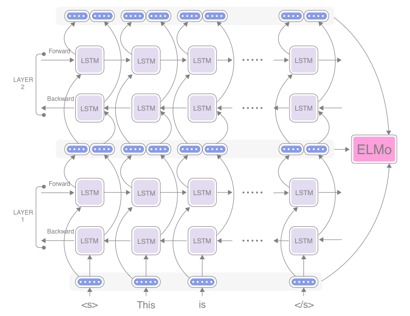

Title: Improving a Sentiment Analyzer using ELMo — Word Embeddings on Steroids
Date: 2018-10-27 00:00
Category: Sentiment Analysis
Tags: Sentiment Analysis, Word Embeddings, ELMo, AllenNLP
Cover: images/elmo.png
slug: improving-sentiment-analyzer-using-elmo

In the [previous post](training-sentiment-analyzer-using-allennlp.html), I showed how to train a sentiment classifier from the Stanford Sentiment TreeBank. Thanks to a very powerful deep NLP framework, [AllenNLP](https://allennlp.org/), we were able to write the entire training pipeline in less than 100 lines of Python code. 

In this post, I'm going to explain how to improve the sentiment analyzer using ELMo.


## What are Word Embeddings?

Before talking about ELMo, let's study word embeddings in depth. What is a word embedding? As I touched upon in the previous post, an embedding in deep learning is a continuous vector representation of something that is usually discrete and high dimensional. In NLP, word embeddings are usually just a mapping table from words to continuous vectors. 

Before the advent of popular word embedding techniques (i.e., word2vec) around 2013, NLP didn't really have nice ways to represent word semantics in a continuous vector space. People used the bag of words (BoW) representation, which is simply a way to map each unique token to a dimension (an axis) in the N-dimensional space by ignoring the word order completely.

Clearly, BoW has several issues, one of which is its inability to represent semantic similarity (or dissimilarity) between words. As an example, let's consider a hypothetical three dimensional space with just three concepts — "dog", "cat", and "pizza". Because each unique word is mapped to a dimension, the vectors for "dog", "cat", and "pizza" will be

- v("dog") = (1, 0, 0)
- v("cat") = (0, 1, 0)
- v("pizza") = (0, 0, 1)

respectively. By the way, those vectors filled with 0s except just one 1 are called one-hot vectors. As you can see, there is no way to know, for example, "dog" and "cat" are related concepts. In the eyes of BoW and one-hot vectors, "dog" is no more similar to "cat" than "pizza" is!

Word embeddings solve this exact issue by representing words not just by one-hot vectors but by sets of continuous numbers. This is why the use of word embeddings has become so popular in recent years in NLP. The vectors for "dog", "cat", and "pizza" can be, for example,

- v("dog") = (0.8, 0.3, 0.1)
- v("cat") = (0.7, 0.5, 0.1)
- v("pizza") = (0.1, 0.2, 0.8)

The first element here represents some concept of "animal-ness" and the third "food-ness". (I'm making these numbers up, but you get the point). Those vectors are learned from a large corpus of natural language text so that words that appear in similar context get assigned similar vectors. By using pre-trained word embeddings instead of one-hot vectors, your model already "knows" how the basic building blocks of the language work. For example, if you wanted to train an "animal name tagger," then all your model has to learn would be to look at just the first element of each word vector and see if the value is high enough. This is a great jump-start from trying to figure out from (1, 0, 0), (0, 1, 0), and (0, 0, 1).       


## What is ELMo?

You may have noticed that word embeddings mentioned above also have another serious issue. A word is assigned the same vector representation no matter where it appears and how it's used, because word embeddings rely on just a look-up table. In other word, they ignore polysemy — a concept that words can have multiple meanings. For example, the word "bank" gets assigned a word vector that is always the same regardless of the context (whether it's a financial institution of a land alongside a river). What if there is a "hot" right before "dog" in a sentence? Suddenly, this "dog" sounds a lot more like "pizza" than "cat"!

I need to mention that it's not that nothing has been done to address this issue. The original word2vec paper \[[Mikolov, et al. 2013](https://papers.nips.cc/paper/5021-distributed-representations-of-words-and-phrases-and-their-compositionality.pdf)\] deals with idiomatic phrases such as "New York" and "Boston Globe" by first detecting those phrases using a data-driven approach and then by treating them as single tokens. There is also a body of work that focuses on learning a vector representation per word sense, not just per word (e.g., \[[Neelakantan et al., 2015](https://arxiv.org/abs/1504.06654)\]). In either case, word embeddings are still based on static mapping tables and you'd need a separate phase to disambiguate word senses.

Human language is something more dynamic. What a word means can depend on what comes before _and_ after it (and possibly beyond sentence boundaries). This is why you get confused when you see sentences like "[The horse raced past the barn fell.](https://en.wikipedia.org/wiki/Garden-path_sentence)" It'd be natural to think of a "word embedding on steroids" which reads the whole sentence once and produces word vectors that take into account the entire sentence as context. This is exactly what ELMo does!
 
ELMo is a word representation technique proposed by AllenNLP \[[Peters et al. 2018](https://arxiv.org/abs/1802.05365)\] relatively recently. Unlike traditional word embedding methods, ELMo is dynamic, meaning that ELMo embeddings change depending on the context even when the word is the same. How can this be possible? In the following sections, I'm going to show how it works.  

## How ELMo works

Instead of relying on mapping tables, ELMo uses a pre-trained language model. That's how the name ELMo got "LM" in it (it stands for Embeddings from Language Models). In general, a language model is a statistical model that gives probabilities to sequences of words, such as phrases and sentences. In deep NLP, recurrent neural networks (RNNs) are often used to train language models. As the RNN reads a sentence word by word, its internal states get updated so that they reflect the "content" of the sentence seen so far.

<figure style="text-align: center">
	
	<figcaption>Figure: ELMo uses internal representations of multi-layer biLM</figcaption>
</figure>

ELMo uses one particular type of language model called biLM, which is a combination of two LMs in both directions. As you can see in the figure above, there are two "passes" — forward and backward — that scan the sentence in both directions. The internal states from the forward pass at a certain word reflect the word itself *and* everything that happened before that word, whereas the ones from the backward pass are computed from the word itself *and* everything after that word. The internal states of both passes get concatenated and produce an intermediate word vector. Therefore, this intermediate word vector at that word is still the representation of what the word means, but it "knows" what is happening in the rest of the sentence and how the word is used. 

Another feature of ELMo is that it uses LMs comprised of multiple layers. Those backward and forward passes are stacked together and form a multilayer RNN, as you can see in the figure. The intermediate word vector produced by the layer below is fed into the next layer above. This is repeated as many times as there are layers. This way, you can expect that internal states get processed further as they go up in the layer ladder, and upper layers can represent more abstract semantics (for example, topics and sentiment) compared to what lower layers can capture (for example, part of speech and short phrases). The final representation used by downstream NLP tasks is the weighed combination of those different intermediate word vectors. Specifically, it is the weighted combination of L+1 word vectors, where L is the number of layers. Why +1? Because the input to biLM (raw word embeddings which you can see at the bottom of the figure) get also combined. The weights are learned in a task-dependent way. 

Finally, ELMo uses a character CNN (convolutional neural network) for computing those raw word embeddings that get fed into the first layer of the biLM. The input to the biLM is computed purely from characters (and combinations of characters) within a word, without relying on some form of lookup tables. Why is this a good thing? First, it can capture the internal structure of words. The model can guess, for example, "dog" and "doggy" are somewhat related, even before seeing how they are used in context at all. Second, it is robust to unknown words that weren't encountered during the training.

A word of caution: the biLM used by ELMo is _different_ from biLSTM although they are very similar. biLM is just a concatenation of two LMs, one forward and one backward. biLSTM, on the other hand, is something more than just a concatenation of two spearate LSTMs. The main difference is that in biLSTM, internal states from both directions are concatenated _before_ they are fed to the next layer, while in biLM, internal states are just concatenated from two independently-trained LMs.

## How to use ELMo

[AllenNLP](https://allennlp.org/), an open-source NLP platform developed by the Allen Institute of Artificial Intelligence, provides pre-trained ELMo models and interfaces that make it very easy for you to integrate ELMo with your model. In what follows, I'm going to demonstrate how to integrate ELMo embeddings with the sentiment analysis model I trained in the [previous post](training-sentiment-analyzer-using-allennlp.html).

In order to integrate ELMo, you need to make only three changes to the script. Firstly, because ELMo uses a character-based CNN to encode words as mentioned above, you need to change how words are indexed when the Stanford Sentiment TreeBank is accessed. AllenNLP provides a convenient `ELMoTokenCharactersIndexer` for this, which basically encodes a word by an array of its character IDs: 

```Python
# In order to use ELMo, each word in a sentence needs to be indexed with
# an array of character IDs.
elmo_token_indexer = ELMoTokenCharactersIndexer()
reader = StanfordSentimentTreeBankDatasetReader(
    token_indexers={'tokens': elmo_token_indexer})
```

Secondly, you need to create an `Embedder` that actually embeds tokens using ELMo, and pass it to `BasicTextFieldEmbedder`. All you need to do is instantiate an [`ElmoTokenEmbedder`](https://allenai.github.io/allennlp-docs/api/allennlp.modules.token_embedders.html#elmo-token-embedder) instead of `Embedding`. It takes two mandatory parameters upon instantiation — `options_file` and `weight_file` — which determine which of the four pre-trained ELMo models that AllenNLP provides you'd like to use to instantiate an `Embedder`. The four pre-trained ELMo models basically differ in the size of the LSTM internal states and the output vectors. You can see the full specifications along with their URLs on [their ELMo page](https://allennlp.org/elmo). In this article, we are going to use the "Small" model:

```Python
# Use the 'Small' pre-trained model
options_file = ('https://s3-us-west-2.amazonaws.com/allennlp/models/elmo'
                '/2x1024_128_2048cnn_1xhighway/elmo_2x1024_128_2048cnn_1xhighway_options.json')
weight_file = ('https://s3-us-west-2.amazonaws.com/allennlp/models/elmo'
               '/2x1024_128_2048cnn_1xhighway/elmo_2x1024_128_2048cnn_1xhighway_weights.hdf5')

elmo_embedder = ElmoTokenEmbedder(options_file, weight_file)

# Pass in the ElmoTokenEmbedder instance instead
word_embeddings = BasicTextFieldEmbedder({"tokens": elmo_embedder})
```

Finally, you need to adjust the input vector size of your LSTM-RNN. By the way, this is not the LSTM used by ELMo, but rather the LSTM you built to classify the sentence. Because we are using the ELMo embeddings as the input to this LSTM, you need to adjust the `input_size` parameter to `torch.nn.LSTM`: 

```Python
# The dimension of the ELMo embedding will be 2 x [size of LSTM hidden states]
elmo_embedding_dim = 256
lstm = PytorchSeq2VecWrapper(
    torch.nn.LSTM(elmo_embedding_dim, HIDDEN_DIM, batch_first=True))
```

The new `input_size` will be 256 because the output vector size of the ELMo model we are using is 128, and there are two directions (forward and backward). 

And that's it! Here's [the entire script](https://github.com/mhagiwara/realworldnlp/blob/master/examples/sentiment/sst_classifier_elmo.py) for training and testing an ELMo-augmented sentiment classifier on the Stanford Sentiment TreeBank dataset. If you run this script, you should get an accuracy of ~0.60 on the training set and ~0.40 on the dev set. If this doesn't sound like a huge improvement from the non-ELMo model we built last time, you are right — we only used the small model this time, and more importantly, we are *not* using the linear combinations of all ELMo biLM layers, but rather just the topmost layer. If you read [the original ELMo paper](https://arxiv.org/pdf/1802.05365.pdf), you realize how important it is to use multiple layers. Each biLM layer represents different types of information and you need to optimize which layers to focus on depending on the task. To obtain all the layers from ELMo, you need to use [`ELMo` class](https://allenai.github.io/allennlp-docs/api/allennlp.modules.elmo.html#module-allennlp.modules.elmo) instead. 

## Configuring the Training Pipeline in JSON

Now, let's switch gears and study how we can do all this without writing a single line of Python code. One of the great features of AllenNLP is that it allows users to write JSON-based configuration files that completely specify how to train a model. Why is this great or even necessary? Didn't we just write an end-to-end specification of an experiment in Python?

The first reason is that it encourages the separation between implementation and experiment metadata. If you have any experience training NLP models (or any ML models in general), you may have encountered a situations like this:
 
1. You start off creating a simple model with fixed values of hyperparameters.
2. Your script is clean and simple.
3. However, your model doesn't perform as well as you'd hoped, so you start tweaking those hyperparameters by changing the script directly.
4. This improves the model performance to a certain degree.
5. Still not satisfied, you start experimenting with different model architectures by replacing RNNs here and there with CNNs, using GRUs instead of LSTM, etc., again by making changes to the script directly.
6. You may also tweak how the data is pre-processed by trying character-based embeddings instead of token-based ones, and by replacing the tokenizer with a different one.

At this point, your script is a huge mess of `if-then`s and glue code that stitches together different components, and unless you are very careful, there's no way to keep track of what you've done so far in this journey. 

The second reason is the separation of dependency from implementation. In such messy code, chances are you have a huge, hairy `Model` that has many sub-components in it. Working with such a as large `Model` is painful and prone to errors, because it becomes progressively harder to make any changes to it while understanding their side effects completely. Also, sub-components of such huge models are usually tightly coupled, making it difficult to reuse the model itself outside the task in question. 

This separation of module dependency into an outside configuration file is a type of programming technique called [dependency injection](https://en.wikipedia.org/wiki/Dependency_injection), which improves the reusability of components and limits the side effect of code changes.  

AllenNLP configuration files are written in [Jsonnet](https://jsonnet.org/), a superset of JSON with added functionalities such as variables and comments. For example, you can write variable declrations as follows:
```
local embedding_dim = 128;
local hidden_dim = 128;
```

First, you specify where the datasets come from and how to read them:
```
"dataset_reader": {
  "type": "sst_tokens",
  "token_indexers": {
    "tokens": {
      "type": "elmo_characters"
    }
  }
},
"train_data_path": "data/stanfordSentimentTreebank/trees/train.txt",
"validation_data_path": "data/stanfordSentimentTreebank/trees/dev.txt",
```

`type` key specifies the name of the instantiated class, and the rest of the keys correspond to the named parameters to the constructor. Then, you can specify your model as follows:

```text
// In order to use a model in configuration, it must
//   1) inherit from the Registrable base class, and
//   2) be decorated by @Model.register("model_name").
// Also, the class has to be discoverable by the "allennlp" command
// by specifying '--include-package [import path]'.

"model": {
  "type": "lstm_classifier",

  // What's going on here -
  // The `word_embeddings` parameter takes an instance of TextFieldEmbedder.
  // In the Python code, you instantiated a BasicTextFieldEmbedder and passed it to
  // `word_embeddings`. However, the default implementation of TextFieldEmbedder is
  // "basic", which is BasicTextFieldEmbedder.
  // That's why you can write parameters to BasicTextFieldEmbedder (dictionary from
  // field names to their embedder) directly here.
  
  "word_embeddings": {
    "tokens": {
	  "type": "elmo_token_embedder",
	  "options_file": "https://s3-us-west-2.amazonaws.com/allennlp/models/elmo/[...].json",
	  "weight_file": "https://s3-us-west-2.amazonaws.com/allennlp/models/elmo/[...].hdf5",
	  "do_layer_norm": false,
	  "dropout": 0.5
    }
  },

  // In Python code, you need to wrap encoders (e.g., torch.nn.LSTM) by PytorchSeq2VecWrapper.
  // Conveniently, "wrapped" version of popular encoder types ("lstm", "gru", ...)
  // are already registered (see https://github.com/allenai/allennlp/blob/master/allennlp/modules/seq2vec_encoders/__init__.py)
  // so you can just use them by specifying intuitive names
    
  "encoder": {
    "type": "lstm",
    "input_size": embedding_dim,
    "hidden_size": hidden_dim
  }
},
```

Finally, you can specify the iterator and the trainer used for the training:
```text
"iterator": {
  "type": "bucket",
  "batch_size": 32,
  "sorting_keys": [["tokens", "num_tokens"]]
},
"trainer": {
  "optimizer": "adam",
  "num_epochs": 20,
  "patience": 10
}
```

You can see [the entire configuration file here](https://github.com/mhagiwara/realworldnlp/blob/master/examples/sentiment/sst_classifier_elmo.json), which can be run by the following command:
```
allennlp train examples/sentiment/sst_classifier_elmo.json \
    --serialization-dir sst-model \
    --include-package examples.sentiment.sst_classifier
```

When you run this, you should see similar accuracy numbers as you saw for the Python script above.

Once you finish training, you can create a test JSON file with one JSON-encoded instance per each line:

```text
{"tokens": ["This", "is", "the", "best", "movie", "ever", "!"]}
{"tokens": ["This", "is", "the", "worst", "movie", "ever", "!"]}
```

which you can feed into the prediction pipeline as below:

```
allennlp predict sst-model/model.tar.gz test.json \
    --include-package examples.sentiment.sst_classifier \
    --predictor sentence_classifier_predictor
```

The predictor used here is the [one you defined and registered previously](https://github.com/mhagiwara/realworldnlp/blob/master/realworldnlp/predictors.py). Note that you need to register you predictor using the `@Predictor.register` decorator instead of `@Model.register`. 

I hope you enjoyed this little tutorial. This is a sample task from my book "Real-World Natural Language Processing", which is to be published in 2019 from Manning Publications. I'll post more information on [the book website](http://realworldnlpbook.com) as I make progress on the book, so stay tuned!
