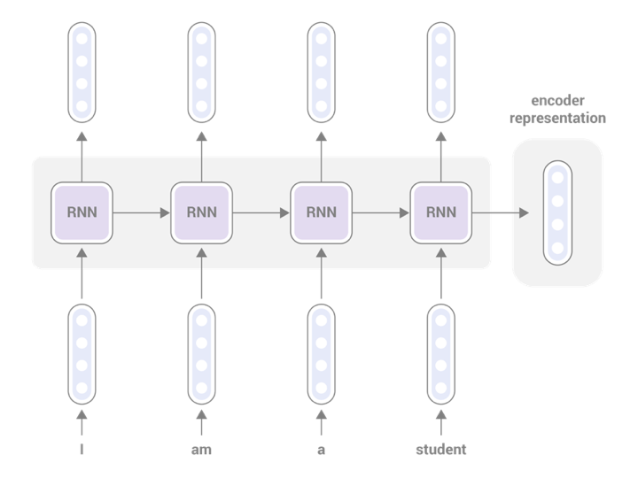
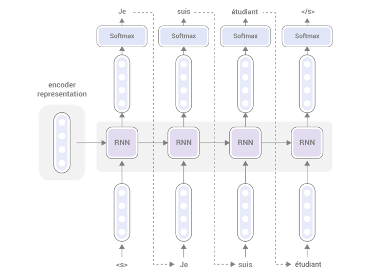
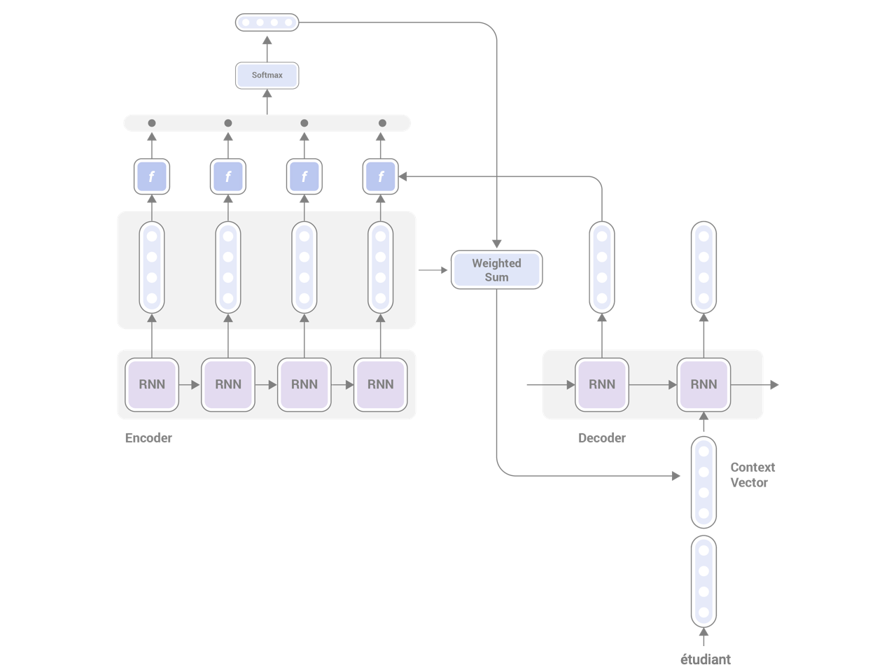
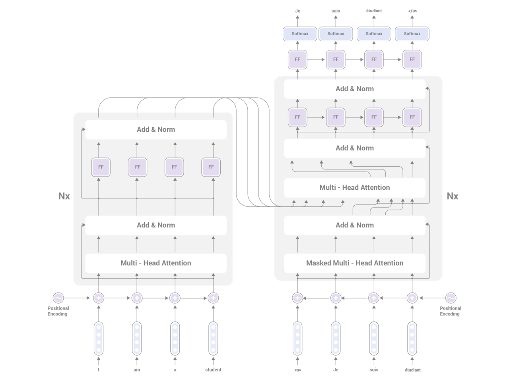

Title: Buidling Seq2Seq Machine Translation Models using AllenNLP
Date: 2018-12-06 00:00
Category: Machine Translation
Tags: Machine Translation, Seq2Seq, AllenNLP
Cover: images/seq2seq-attention.png
slug: building-seq2seq-machine-translation-models-using-allennlp

In the past two posts, I introduced [how to build a sentiment analyzer](http://www.realworldnlpbook.com/blog/training-sentiment-analyzer-using-allennlp.html) using AllenNLP and [how to improve it using ELMo](http://www.realworldnlpbook.com/blog/improving-sentiment-analyzer-using-elmo.html).
AllenNLP is a very powerful framework that enables you to train many other NLP models with little to no code. In this post, I'll explain how to train Seq2Seq machine translation models using AllenNLP.    

## Machine Translation 101

Machine translation is probably one of the most popular and easy-to-understand NLP applications. It is also one of the most well-studied, earliest applications of NLP. Machine translation systems, given a piece of text in one language, translate to another language. The language the input text is written in is called the *source language*, while the one for the output is called the *target language*. You can think of MT as a language generation task, because it needs to generate an output that is natural in the target language based on the input.

One challenge in MT is generating translation that is natural in the target language while preserving the exact meaning expressed by the input. The former, i.e., the naturalness of the generated text is called *fluency*, while the latter, the degree to which the output reflects the meaning of the source is called *adequacy*. These two are often in conflict, especially when the source and the target languages are not very similar (for example, English and Mandarin Chinese). Good human translators address this trade-off in a creative way. The goal of general MT systems is to learn from good translators to achieve human-quality translations.

## Data Preparation

Machine translation models learn how to translate from a large amount of parallel text, which is a collection of paired source (original) and target (translated) sentences. I'm going to to use the data from [Tatoeba.org](https://tatoeba.org/eng) to create a parallel corpus. Tatoeba.org is an incredible resource of linguistic data, containing millions of sentences and translations in hundreds of different languages, and they are all available under the Creative Commons License. 

We are going to download their data dump from the [downloads page](https://tatoeba.org/eng/downloads). After downloading `sentences.tar.bz2` and `links.tar.bz2` and extracting them, run this [pre-processing script](https://github.com/mhagiwara/realworldnlp/blob/master/examples/mt/create_bitext.py) to extract parallel sentences as follows. As of this writing (December 2018), this creates ~42,000 Chinese-English pairs. 

```
python examples/mt/create_bitext.py eng_cmn data/mt/sentences.csv data/mt/links.csv \
	| cut -f3,6 > data/mt/tatoeba.eng_cmn.tsv
```

The first command-line argument specifies `[source language code]_[target language code]`. This is also called a *language pair*, and usually one MT system is trained per one language pair (this is not always the case—for example, Google studies [a neural MT model](https://arxiv.org/abs/1611.04558) that can translate between multiple languages). You can change this argument to extract any language pair you want. 

You can check the first several lines of the generated file by the `head` command: 

```text
Let's try something.	我們試試看！
I have to go to sleep.	我该去睡觉了。
Today is June 18th and it is Muiriel's birthday!	今天是６月１８号，也是Muiriel的生日！
Muiriel is 20 now.	Muiriel现在20岁了。
The password is "Muiriel".	密码是"Muiriel"。
The password is "Muiriel".	密碼是「Muiriel」。
I will be back soon.	我很快就會回來。
I'm at a loss for words.	我不知道應該說什麼才好。
This is never going to end.	這個永遠完不了了。
This is never going to end.	这将永远继续下去。
```

One caveat is that Chinese sentences on Tatoeba are a mix of simplified and traditional Chinese. If look at the first two sentences and if you know Chinese, you'll notice that the first one is in traditional and the second one in simplified. This kind of inconsistency can cause some issues in MT, for example, degraded performance and inconsistent output. There are other types of linguistic inconsistencies that you may want to watch out for before you start training an MT system, including: upper and lower cases, punctuations, accents, and so on. Paying attention to details goes a long way in developing NLP applications. In this article, I'll simply ignore this issue. If you have time, you could try, for example, normalizing everything to simplified Chinese, or using a classifier to filter out sentences written in a script that you don't want.   

Next, we'll split this dataset into train (80%), dev (10%), and test (10%) sets. The dev (development) set is also called a validation set. It is a common practice to do this split by taking one line out of every 10 lines using a modulo operator, as in:      

```
cat data/mt/tatoeba.eng_cmn.tsv | awk 'NR%10==1' > data/mt/tatoeba.eng_cmn.test.tsv
cat data/mt/tatoeba.eng_cmn.tsv | awk 'NR%10==2' > data/mt/tatoeba.eng_cmn.dev.tsv
cat data/mt/tatoeba.eng_cmn.tsv | awk 'NR%10!=1&&NR%10!=2' > data/mt/tatoeba.eng_cmn.train.tsv
```

After running this, ```tatoeba.eng_cmn.test.tsv``` will contain every 10th line where line number (1-base) modulo 10 equals 1. Similarly, ```tatoeba.eng_cmn.dev.tsv``` is every 10th line where line number modulo 10 equals 2. All the other sentences go into ```tatoeba.eng_cmn.train.tsv```. This means train, dev, and test sets contain ~4k, ~4k, and ~34k sentences, respectively. This is a very small dataset by the MT standard, but it's big enough to prototype and compare basic MT models quickly.  

## Loading and Processing Data

It is easy to load and pre-process parallel corpora using AllenNLP. The library provides `Seq2SeqDatasetReader`, which takes care of reading a tab-separated file containing parallel sentences. All you need to do is instantiate it with appropriate parameters:

```python
reader = Seq2SeqDatasetReader(
    source_tokenizer=WordTokenizer(),
    target_tokenizer=CharacterTokenizer(),
    source_token_indexers={'tokens': SingleIdTokenIndexer()},
    target_token_indexers={'tokens': SingleIdTokenIndexer(namespace='target_tokens')})
```

Note that we need to use `WordTokenizer` on the source side but `CharacterTokenizer` on the target side. This is because we want to use words as the basic unit in English while we want to use characters as the basic unit in Chinese. As you can see above, written Chinese doesn't use whitespace to tokenize words. You could pre-tokenize Chinese sentences using word-tokenization tools such as [jieba](https://github.com/fxsjy/jieba) or [Stanford Chinese word segmentor](https://nlp.stanford.edu/software/segmenter.shtml). You could alternatively use [byte-pair encoding (BPE)](https://arxiv.org/abs/1508.07909), which is an increasingly popular way to segment text in any language in an unsupervised manner for neural network models. However, in this article we'll simply use characters as proxy for words.     

One tricky part here is the namespace. A namespace in AllenNLP is something like a prefix added to the vocabulary index. We need to specify different namespaces for the source and the target side, because failing to do so could lead to vocabulary from both languages mixed up. For example, you don't want *chat* in French (meaning *cat*) to be confused with *chat* in English, right? However, the risk of this happening is a lot lower between English and Chinese.

## Encoder and Decoder

A neural machine translation model is comprised of two parts—an encoder and a decoder. The encoder's job is to receive the source sentence as the input and convert it to some intermediate representation, usually a vector or a series of vectors. The decoder receives this representation and produces the target sentence. Translation generation is usually *auto-regressive*, meaning that the generation is conditioned on the encoder representation and the history, i.e., the words already generated by the decoder.

## Vanilla Seq2Seq Model

Neural network models that generates a sequence from another sequence using the encoder-decoder architecture are called sequence-to-sequence (or more simply, Seq2Seq) models. The simplest type of Seq2Seq model is just a combination of an RNN-based encoder and decoder: 

<figure style="text-align: center">
	
	<figcaption>Figure: RNN-based Encoder</figcaption>
</figure>

<figure style="text-align: center">
	
	<figcaption>Figure: RNN-based Decoder</figcaption>
</figure>

"RNN" in the figures above are RNN cells, which are the atomic unit of computation for RNNs. In this article, we use LSTM (long short term memory). In the vanilla Seq2Seq model, the encoder representation is just a vector, whose length is the same as the hidden size of the RNN. In other words, the encoder is trying to "compress" the entire sentence into just a fixed-sized, one-dimensional vector. If you think this is a very challenging task, hold that thought for now. I'll get to it later.

AllenNLP provides a very convenient `Seq2SeqEncoder` abstraction. You can initialize this by passing PyTorch's RNN modules, as in:

```python
encoder = PytorchSeq2SeqWrapper(
    torch.nn.LSTM(EN_EMBEDDING_DIM, HIDDEN_DIM, batch_first=True))

```

There is no separate abstraction for decoder (yet) in AllenNLP, but it provides the `SimpleSeq2Seq` class, which takes care of running the encoder and generating the output sequence by decoding based on a hard-coded LSTM decoder:

```python
model = SimpleSeq2Seq(vocab, source_embedder, encoder, max_decoding_steps,
                      target_embedding_dim=ZH_EMBEDDING_DIM,
                      target_namespace='target_tokens',
                      beam_size=8,
                      use_bleu=True)
``` 

The details of decoding and beam search are out of the scope of this article—there are great learning resources online (for example, this [blog article](https://guillaumegenthial.github.io/sequence-to-sequence.html)) if you are interested in learning more!

Notice I added `use_bleu=True` here. This means that, in addition to the training loss (cross entropy), the training process monitors BLEU, the most commonly used evaluation metric for translation quality. BLEU comes up with a score that is correlated with human evaluation by comparing the prediction from the MT system with *references*, which are human translated sentences for the input. See [the Wikipedia article](https://en.wikipedia.org/wiki/BLEU) for more details.

## Training and Evaluation

With the model defined, you can train it using the regular `Trainer` class as follows:

```python
trainer = Trainer(model=model,
                  optimizer=optimizer,
                  iterator=iterator,
                  train_dataset=train_dataset,
                  validation_dataset=validation_dataset,
                  num_epochs=1,
                  cuda_device=CUDA_DEVICE)

for i in range(50):
    print('Epoch: {}'.format(i))
    trainer.train()

    predictor = SimpleSeq2SeqPredictor(model, reader)

    for instance in itertools.islice(validation_dataset, 10):
        print('SOURCE:', instance.fields['source_tokens'].tokens)
        print('GOLD:', instance.fields['target_tokens'].tokens)
        print('PRED:', predictor.predict_instance(instance)['predicted_tokens'])
```

I made a small modification here so that we can monitor the progress of training by taking a peek into how the first 10 instances in the validation dataset are translated at every epoch. This can be easily achieved by passing an instance from the validation set to a `SimpleSeq2SeqPredictor`.

If you run this, you'll see a report like the one below at every epoch. This is what I got after 50 epochs using the model described so far:

```text
12/08/2018 21:25:02 - INFO - allennlp.training.trainer -            Training |  Validation
12/08/2018 21:25:02 - INFO - allennlp.training.trainer -   loss |     0.288  |     4.690
12/08/2018 21:25:02 - INFO - allennlp.training.trainer -   BLEU |       N/A  |     0.083
12/08/2018 21:25:02 - INFO - allennlp.training.trainer -   Epoch duration: 00:00:51
SOURCE: [@start@, I, have, to, go, to, sleep, ., @end@]
GOLD: [@start@, 我, 该, 去, 睡, 觉, 了, 。, @end@]
PRED: ['我', '该', '去', '睡', '觉', '了', '。']
SOURCE: [@start@, I, just, do, n't, know, what, to, say, ., @end@]
GOLD: [@start@, 我, 就, 是, 不, 知, 道, 說, 些, 什, 麼, 。, @end@]
PRED: ['我', '不', '相', '信', '汤', '姆', '。']
...
```

If you look at how these sentences are translated, the prediction for the first sentence matches GOLD exactly, while the second one is completely off:
```text
SOURCE: I have to go to sleep.
GOLD: 我该去睡觉了。
PRED: 我该去睡觉了。

SOURCE: I just don't know what to say.
GOLD: 我就是不知道說些什麼。
PRED: 我不相信汤姆。 ("I don't believe Tom.")
``` 

You'll notice the same trend by looking at other sentences in the validation dataset. In general, vanilla Seq2Seq MT systems are good at "hallucinating" good translations, i.e., translations that are fluent but have little to do with the source sentence. This is reflected by the low BLEU score (0.083) here.

If you remember the architecture of this Seq2Seq model, this low performance seems pretty much inevitable. All the decoder knows about the source sentence is a fixed-length (in this case, 256 dimensional) real-valued vector, no matter how long or complex the sentence is. You may be able to represent something simple, like "Hello" or "He is Tom." but imagine being asked to reproduce "I'm not a real fish, I'm just a mere plush." from 256 numbers. In other words, the fixed-length encoder representation is a huge bottleneck for vanilla Seq2Seq models. 

## Attention

The attention mechanism, first proposed by [Bahdanau et al., 2014](https://arxiv.org/abs/1409.0473), solves this bottleneck by introducing an additional information pathway from the encoder to the decoder. In general, attention is a memory access mechanism similar to a key-value store. You have a database of "things" represented by values that are indexed by keys. You use a query and similarity between the query and the keys to retrieve the relevant information. In neural networks, keys, values, and queries are all represented by vectors (or generally, tensors). 

In Seq2Seq Models with attention, keys, values, and queries are as follows: 

* keys ... RNN hidden states from the encoder
* values ... RNN hidden states from the encoder (same as keys)
* query ... RNN hidden state at the previous timestep from the decoder

Using those, the decoding proceeds as follows:

1. Encode the source sentence. This produces a total of N vectors each of which corresponds to the RNN hidden states at time t (N is the length of the source sentence). These N vectors become keys and values.
2. Decode one word at a time. When decoding the word at time t, use the RNN hidden states at t-1 as the query.
3. Calculate the "similarity" between the query and each of the N keys using some function (will be discussed below). This will produce a total of N "scores" that capture the similarities between the query and the keys.
4. Apply softmax over the N scores, which produces a probability distribution over the input tokens. These are called *attention weights*.
5. Compute the weighted sum of values using the attention weights. This will produce a single vector called *context vector* whose length is the same as the hidden states.
6. Finally, add the context vector to the hidden states at t-1 and use both for decoding the next word. 

You can think of attention as a mechanism to peek into relevant parts of the input sentence that help predict the next word. If you have experience translating between two languages, you may notice this is somewhat similar to what human translators do while translating. They constantly refer to relevant parts of the original sentence while translating. The following figure illustrates the architecture of a Seq2Seq model with attention.  

<figure style="text-align: center">
	
	<figcaption>Figure: Seq2Seq Model with Attention</figcaption>
</figure>

AllenNLP provides abstractions for attention. `LinearAttention` is what you need if you'd like to replicate what's done in (Bahdanau et al., 2014). If you are interested in the mathematical details, read [this excellent blog article](https://guillaumegenthial.github.io/sequence-to-sequence.html). 

```python
attention = LinearAttention(HIDDEN_DIM, HIDDEN_DIM, activation=Activation.by_name('tanh')())
```

Don't forget to pass the attention to `SimpleSeq2Seq`!

```python
model = SimpleSeq2Seq(vocab, source_embedder, encoder, max_decoding_steps,
                      target_embedding_dim=ZH_EMBEDDING_DIM,
                      target_namespace='target_tokens',
                      attention=attention,	 # pass attention
                      beam_size=8,
                      use_bleu=True)
```

This is what I got after adding attention and retraining the model:

```text
12/09/2018 03:10:36 - INFO - allennlp.training.trainer -            Training |  Validation
12/09/2018 03:10:36 - INFO - allennlp.training.trainer -   BLEU |       N/A  |     0.118
12/09/2018 03:10:36 - INFO - allennlp.training.trainer -   loss |     0.125  |     4.561
12/09/2018 03:10:36 - INFO - allennlp.training.trainer -   Epoch duration: 00:01:09
```

This is a great improvement (BLEU 0.083 -> 0.118)! If you look at the predictions, they are still not perfect but make much much more sense:

```text
SOURCE: I have to go to sleep.
GOLD: 我该去睡觉了。
PRED: 我睡觉了。 ("I went to sleep.")

SOURCE: I just don't know what to say.
GOLD: 我就是不知道說些什麼。
PRED: 我只不知道要说什么。 ("I just don't know what to say.")

SOURCE: I may give up soon and just nap instead .
GOLD: 也许我会马上放弃然后去睡一觉。
PRED: 我又要马上就能放弃了。 ("I can give up soon again.")
```

## More Attention

I mentioned above that the similarity between the query and a key is calculated by "some function."  `LinearAttention` is one way to do this. Behind the scenes, it computes a linear transformation of the input vectors (more specifically, the concatenation of the input vectors by default), followed by a non-linear activation and a dot product. This corresponds to the *concat* scoring function described in [(Luong et al. 2015)](https://arxiv.org/abs/1508.04025). The same paper also proposes two other alternatives to the *concat* function, namely, *dot* and *general*, which can be achieved by `DotProductAttention` and `BilinearAttention` in AllenNLP.  

When I used `DotProductAttention` and  `BilinearAttention` (with default parameters) instead of `LinearAttention`, the validation BLEU scores were 0.126 and 0.114, respectively. With this dataset, *dot* seems to be the best choice as the scoring function, which is congruent with the results in (Luong et al. 2015).

## Transformer

Finally, I'm going to touch upon the Transformer. The Transformer is a new encoder-decoder architecture proposed in the paper ["Attention is All You Need" (Vaswani et al. 2017)](https://arxiv.org/abs/1706.03762) that relies solely on the attention mechanism instead of recurrent neural networks. It's built by stacking multiple layers of *self-attention* layers. Self-attention is an attention architecture where all of keys, values, and queries come from the input sentence itself. One of some advantages of self-attention is that it's easier to capture longer range dependency between words. Because RNN is sequential, it takes 10 computation steps if two words are ten words apart. In self-attention, it's just one layer, because it only needs to *attend* to it. Please refer to [this wonderful blog post](https://jalammar.github.io/illustrated-transformer/) for more details about the Transformer.

<figure style="text-align: center">
	
	<figcaption>Figure: Architecture of the Transformer</figcaption>
</figure>

As of this writing, AllenNLP supports a Transformer encoder, which is implemented as `StackedSelfAttentionEncoder`. You can instantiate it as follows:

```python
encoder = StackedSelfAttentionEncoder(
	input_dim=EN_EMBEDDING_DIM,
	hidden_dim=HIDDEN_DIM,
	projection_dim=128,
	feedforward_hidden_dim=128,
	num_layers=1,
	num_attention_heads=8)
```

Please refer to the original paper or the blog post mentioned above for the details of the parameters. When I experimented with this, I had a hard time training a Transformer encoder that has more than one layer (the results were far worse than the RNN models). When I tried the combination of the parameters above, I got:   

```text
12/20/2018 18:56:00 - INFO - allennlp.training.trainer -            Training |  Validation
12/20/2018 18:56:00 - INFO - allennlp.training.trainer -   BLEU |       N/A  |     0.128
12/20/2018 18:56:00 - INFO - allennlp.training.trainer -   loss |     0.393  |     3.704
12/20/2018 18:56:00 - INFO - allennlp.training.trainer -   Epoch duration: 00:01:04
```

```text
SOURCE: I have to go to sleep.
GOLD: 我该去睡觉了。
PRED: 我必須睡覺。 ("I must sleep.")

SOURCE: I just don't know what to say.
GOLD: 我就是不知道說些什麼。
PRED: 我也不知道说什么。 ("I don't know what to say either")

SOURCE: I may give up soon and just nap instead .
GOLD: 也许我会马上放弃然后去睡一觉。
PRED: 我可能趕上，但卻以後悔負。("I can catch up, but I'll regret it later.")
```

Not all the predictions here are grammatical and some of them are overly "creative", but overall the performance is comparable to the best RNN model with the *dot* attention we saw above.

OK, that's it for now. The [full code is here](https://github.com/mhagiwara/realworldnlp/blob/master/examples/mt/mt.py). I did little hyper-parameter tuning or improvement, but by looking at predictions and type of mistakes, it won't be difficult to come up with a couple of improvement ideas quickly. Hope you enjoy building your own MT systems using AllenNLP as much as I did!

