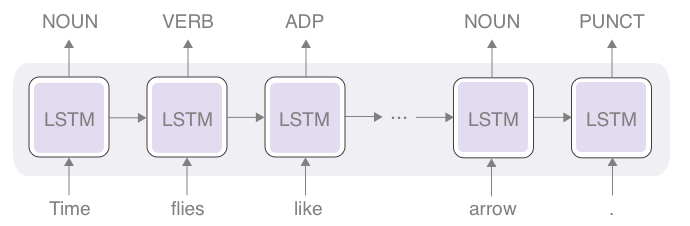
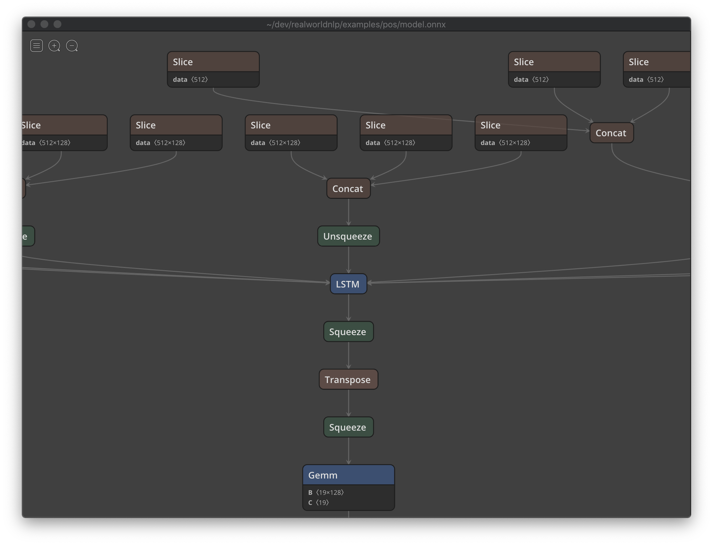

Title: How to Convert an AllenNLP model and Deploy on Caffe2 and TensorFlow
Date: 2019-01-09 00:00
Category: Part-of-speech Tagging
Tags: Part-of-speech Tagging, Sequential Labeling, AllenNLP, ONNX, Caffe2, TensorFlow
Cover: images/pos.png
slug: how-to-convert-an-allennlp-model-and-deploy-on-caffe2-and-tensorflow

In the [last](http://www.realworldnlpbook.com/blog/training-sentiment-analyzer-using-allennlp.html) [three](http://www.realworldnlpbook.com/blog/improving-sentiment-analyzer-using-elmo.html) [posts](http://www.realworldnlpbook.com/blog/building-seq2seq-machine-translation-models-using-allennlp.html), I talked mainly about how to train NLP models using [AllenNLP](https://allennlp.org/). AllenNLP is a great NLP framework especially for quickly prototyping research models. However, it is not optimized for scalability or portability, and it comes with a ton of dependencies that are handy when you are doing research but you may not want in your production environment.

On the other hand, there are other deep learning frameworks that excel in different areas. For example, Caffe2 is designed for scale and portability, especially mobile deployment. TensorFlow, probably the most popular deep learning framework as of today, also has [TF Lite](https://www.tensorflow.org/lite/) and [TensorFlow.js](https://js.tensorflow.org/), which enable mobile and Web deployment of TensorFlow models, respectively. 

Is it possible to still use AllenNLP to quickly prototype and train NLP models and deploy them using other frameworks mentioned above? The answer is yes, and this article explains how.  

## Part-of-Speech (POS) Tagging and Universal POS Tagset

The NLP task I'm going to use throughout this article is part-of-speech tagging. It's time for some Linguistic 101. A *part of speech (POS)* is a category of words that share similar grammatical properties, such as nouns (_person_, _pizza_, _tree_, _freedom_, etc. etc.) and verbs (_look_, _run_, _know_, etc. etc). The English language has other parts of speech including:

* Adjectives (_green_, _furious_)
* Adverbs (_cheerfully_, _almost_)
* Determiners (_a_, _the_, _this_, _that_)
* Prepositions (_in_, _from_, _with_)
* Conjunctions (_and_, _yet_, _because_)
* ... and many others

Almost all languages we speak here on earth have nouns and verbs. If you speak some languages other than English, you may know that other parts of speech differ from languages to languages. For example, many languages, such as Hungarian, Turkish, and Japanese, have *postpositions* instead of prepositions, which are placed *after* words to add some extra meaning to them. 

A part-of-speech tagger is an NLP system that automatically tags each word in a sentence with a corresponding part-of-speech tag. For example, if you run a Penn-Treebank-style pos tagger on a sentence "I saw a girl with a telescope." you'll get the following result: 


| PRP | VBD | DT | NN   | IN   | DT | NN        | . |
|-----|-----|----|------|------|----|-----------|---|
| I   | saw | a  | girl | with | a  | telescope | . |

Part-of-speech taggers play an important role in NLP pipelines and applications. Traditionally, part-of-speech taggers were trained per language and tagset. One tagset in one language is not compatible with another. Due to growing interests in multi-lingual NLP technologies that are applicable across various languages, a group of NLP researchers came up with a set of tags that cover frequent parts of speech that exist in most languages, called a [universal part-of-speech tagset](http://universaldependencies.org/u/pos/). This tagset groups parts of speech in various languages into a common set of coarse tags, such as NOUN, VERB, ADJ, etc. It is widely used for multi-lingual NLP tasks.   

## Using Universal Dependencies Corpora

In this post, we are going to train a part-of-speech tagger that follows the universal POS taget standard. A large number of text corpora annotated with the universal POS tagset are distributed at [the Universal Dependencies website](http://universaldependencies.org/) under very permissible license (Creative Commons in most cases). Let's go ahead and download the tar+gzipped archive of all universal dependencies corpora from [this page](https://lindat.mff.cuni.cz/repository/xmlui/handle/11234/1-2895) and extract the contents. This will create a directory named `ud-treebanks-v2.3` with a bunch of subdirectories corresponding to various text corpora in many languages.   

We are going to use the English Web Treebank dataset, which can be found under the `UD_English-EWT` subdirectory. The dataset contains texts in various genres including blogs, newsgroups, email, reviews, and so on. The first several lines of the training data in `UD_English-EWT/en_ewt-ud-train.conllu` look like the following:  

```text
# newdoc id = weblog-juancole.com_juancole_20051126063000_ENG_20051126_063000
# sent_id = weblog-juancole.com_juancole_20051126063000_ENG_20051126_063000-0001
# text = Al-Zaman : American forces killed Shaikh Abdullah al-Ani, the preacher at the mosque in the town of Qaim, near the Syrian border.
1       Al      Al      PROPN   NNP     Number=Sing     0       root    0:root  SpaceAfter=No
2       -       -       PUNCT   HYPH    _       1       punct   1:punct SpaceAfter=No
3       Zaman   Zaman   PROPN   NNP     Number=Sing     1       flat    1:flat  _
4       :       :       PUNCT   :       _       1       punct   1:punct _
5       American        american        ADJ     JJ      Degree=Pos      6       amod    6:amod  _
6       forces  force   NOUN    NNS     Number=Plur     7       nsubj   7:nsubj _
7       killed  kill    VERB    VBD     Mood=Ind|Tense=Past|VerbForm=Fin        1       parataxis       1:parataxis     _
8       Shaikh  Shaikh  PROPN   NNP     Number=Sing     7       obj     7:obj   _
9       Abdullah        Abdullah        PROPN   NNP     Number=Sing     8       flat    8:flat  _
10      al      al      PROPN   NNP     Number=Sing     8       flat    8:flat  SpaceAfter=No
11      -       -       PUNCT   HYPH    _       8       punct   8:punct SpaceAfter=No
12      Ani     Ani     PROPN   NNP     Number=Sing     8       flat    8:flat  SpaceAfter=No
13      ,       ,       PUNCT   ,       _       8       punct   8:punct _
...
```

The universal dependencies datasets are in the [CONLL-U](http://universaldependencies.org/format.html) format. Its details are out of the scope of this article, but you can see universal POS tags in the fourth column (`PROPN`, `PUNCT`, `PROPN`, `PUNCT`, `ADJ`, ...). The corpus also has a lot of other information, including morphological tags and dependency tags, but we are not going to use them here.

## Training a Universal POS Tagger using AllenNLP

NOTE: You can try running the script yourself on Google Colab, a free, online Jupyter notebook environment by following [this link](https://colab.research.google.com/github/mhagiwara/realworldnlp/blob/master/examples/pos/pos_tagger.ipynb).

First, let's train a POS tagger using AllenNLP in a standard way. It is very easy to read universal dependencies files using AllenNLP. The framework already implements `UniversalDependenciesDatasetReader`, which takes care of reading dataset files in the CONLL-U format:

```python
reader = UniversalDependenciesDatasetReader()
train_dataset = reader.read('data/ud-treebanks-v2.3/UD_English-EWT/en_ewt-ud-train.conllu')
dev_dataset = reader.read('data/ud-treebanks-v2.3/UD_English-EWT/en_ewt-ud-dev.conllu')
```

The rest of the training pipeline looks almost identical to the [official AllenNLP tutorial](https://allennlp.org/tutorials), except there are a couple of changes you need to make.

The first change is the `LstmTagger` model. Because we are dealing with instances created from the universal dependencies format that have a couple of extra fields in addition to `words` and `pos_tags` and AllenNLP automatically "destructures" fields in instances as parameters to `forward()`, you need to change the signature of the `forward()` method to accommodate it (notice `forward()` has an extra `**args`):

```python
class LstmTagger(Model):
    def __init__(self,
                 embedder: TextFieldEmbedder,
                 encoder: Seq2SeqEncoder,
                 vocab: Vocabulary) -> None:
        super().__init__(vocab)
        self.embedder = embedder
        self.encoder = encoder
        self.hidden2tag = torch.nn.Linear(in_features=encoder.get_output_dim(),
                                          out_features=vocab.get_vocab_size('pos'))
        self.accuracy = CategoricalAccuracy()

    def forward(self,
                words: Dict[str, torch.Tensor],
                pos_tags: torch.Tensor = None,
                **args) -> Dict[str, torch.Tensor]:
        mask = get_text_field_mask(words)
        embeddings = self.embedder(words)
        encoder_out = self.encoder(embeddings, mask)
        tag_logits = self.hidden2tag(encoder_out)
        output = {"tag_logits": tag_logits}
        if pos_tags is not None:
            self.accuracy(tag_logits, pos_tags, mask)
            output["loss"] = sequence_cross_entropy_with_logits(tag_logits, pos_tags, mask)

        return output
```

The rest of the model is almost the same as the model in the AllenNLP tutorial, which is the standard LSTM-RNN sequential labeling model (see below for the architecture diagram). The input is fed to the RNN token by token, after a word embedding layer. LSTM updates its internal states at each timestep, which are used as "output" from LSTM. The output tensors are fed to a linear layer, which then produces tensors that have the same dimension as the total number of POS tags. After a sofmax layer, this gives you a probability distribution over the POS tags. The model is trained using the standard cross entropy loss.

<figure style="text-align: center">
	
	<figcaption>Figure: RNN-based Universal POS Tagger</figcaption>
</figure>

The second change is less important—you need to implement a predictor  if you'd like to check if the model is working as expected. I'm not listing the entire code for the predictor here. If you are interested, you can [see it from here](https://github.com/mhagiwara/realworldnlp/blob/master/realworldnlp/predictors.py#L28).

When you run the [training script](https://colab.research.google.com/github/mhagiwara/realworldnlp/blob/master/examples/pos/pos_tagger.ipynb) for 10 epochs, the metrics should look like this: 

```text
                     Training |  Validation
   accuracy      |     0.962  |     0.884
   loss          |     0.096  |     0.494
```

You'll also see the correct sequnce of POS tags for the example sentence "Time flies like an arrow.": `['DET', 'NOUN', 'VERB', 'DET', 'NOUN', 'PUNCT']`. This is not a bad start!

## Making an AllenNLP Model "ONNX Friendly"

Now that we are a working POS tagger model, let's start the process of converting and deploying it using other frameworks. The first step is to convert the neural network model to [the ONNX format](https://onnx.ai/), which is an open standard to represent deep neural network models.

Unfortunately, the design of standard AllenNLP models is specific to the framework, which makes it difficult to export the model as is—you can't just follow [the PyTorch tutorial](https://pytorch.org/tutorials/advanced/super_resolution_with_caffe2.html) to convert it to the ONNX format. 

There are a couple of factors about AllenNLP models that make the straightforward conversion to ONNX difficult, which I'm going to address one by one in the following.

* Dependency — AllenNLP models rely on `Vocabulary` internally, while ONNX models can't have internal states. You need to externalize such dependencies before converting them.  

* Input/Output interface — AllenNLP models can take dictionaries as input and produce a dictionary as output. On the other hand, ONNX models pretty much only support tensors as inputs and outputs.

* Control flow — some AllenNLP models put the data through some pipelines that contain a lot of dynamic control flow behind the scenes. For example, the `PytorchSeq2SeqWrapper` model we used in the training script above does a large amount of "dirty work" such as taking care of empty sequences and sorting sequences by their lengths etc. While this is great for research prototyping, ONNX doesn't support such dynamic control flows.

To address the points above, the solution I came up is to separate a "pure PyTorch" model from the AllenNLP model, so that the former doesn't contain any of the above. Specifically, I defined a pure PyTorch, ONNX-friendly model `LstmTaggerInnerModel` as follows:

```python
class LstmTaggerInnerModel(torch.nn.Module):
    def __init__(self,
                 embedding: Embedding,
                 encoder: torch.nn.Module,
                 encoder_output_size: int,
                 label_size: int):
        super().__init__()
        self.embedding = embedding
        self.encoder = encoder
        self.hidden2tag = torch.nn.Linear(in_features=encoder_output_size,
                                          out_features=label_size)

    def forward(self, x, mask):
        embedded_x = self.embedding(x)
        lengths = get_lengths_from_binary_sequence_mask(mask)
        packed_x = pack_padded_sequence(embedded_x, lengths, batch_first=True)
        encoder_out, _ = self.encoder(packed_x)
        unpacked, _ = pad_packed_sequence(encoder_out, batch_first=True)
        tag_logits = self.hidden2tag(unpacked)
        return tag_logits
```

You can wrap this inner model by the original `LstmTagger` as follows:

```python
class LstmTagger(Model):
    def __init__(self,
                 inner_model: LstmTaggerInnerModel,
                 vocab: Vocabulary) -> None:
        super().__init__(vocab)
        self.inner_model = inner_model
        self.accuracy = CategoricalAccuracy()

    def forward(self,
                words: Dict[str, torch.Tensor],
                pos_tags: torch.Tensor = None,
                **args) -> Dict[str, torch.Tensor]:
        tokens = words['tokens']
        mask = get_text_field_mask(words)

        # By default, instances from BucketIterator are sorted in an ascending order of
        # sequences lengths, but pack_padded_sequence expects a descending order
        mask = torch.flip(mask, [0])
        tokens = torch.flip(tokens, [0])
        pos_tags = torch.flip(pos_tags, [0])

        tag_logits = self.inner_model(tokens, mask)

        output = {"tag_logits": tag_logits}
        if pos_tags is not None:
            self.accuracy(tag_logits, pos_tags, mask)
            output["loss"] = sequence_cross_entropy_with_logits(tag_logits, pos_tags, mask)

        return output

    def get_metrics(self, reset: bool = False) -> Dict[str, float]:
        return {"accuracy": self.accuracy.get_metric(reset)}
```

If you are not familiar with the concepts of padding, packing, and masking, I encourage you to check out [PyTorch's official chatbot tutorial first](https://pytorch.org/tutorials/beginner/chatbot_tutorial.html).

This is almost as if you are writing pure PyTorch models from scratch.  Do you still gain anything from using AllenNLP? I'd say yes—AllenNLP still takes care of a lot of dirty work that is peripheral when training NLP models, such as building vocabulary, batching, controlling the training loop, etc, which are all non-trivial if you were to implement from scratch.

## Feeding Correct Batches

Now, you need to train the "inner model" that you took out of the original AllenNLP model. Because the inner model directly calls `pack_padded_sequence`, which expects a batch where instances are sorted in an descending order of sequence lengths, you need to make sure the AllenNLP training pipeline is feeding "correct" batches to the model. This was not a problem before because the AllenNLP's `PytorchSeq2SeqWrapper` did all the dirty work. 

First, you need to make sure to pass `padding_noise=0.` to `BucketIterator`. Otherwise, there'd be some "noise" in the lengths of sequences in a batch, which in turn requires sorting the instances.

```python
iterator = BucketIterator(batch_size=16,
                          sorting_keys=[("words", "num_tokens")],
                          padding_noise=0.)
```

Also, because `BucketIterator` by default returns batches where instances are sorted in an *ascending* order of sequence lengths, you need to flip the order of instances as follows: 

```python
mask = torch.flip(mask, [0])
tokens = torch.flip(tokens, [0])
pos_tags = torch.flip(pos_tags, [0])
```

Now you are ready to train the model. See [here](https://github.com/mhagiwara/realworldnlp/blob/master/examples/pos/train_onnx_tagger.py) for the entire training script. If you run this for 10 epochs, you'll see the metrics that are slightly different from the ones you got before:

```text
                     Training |  Validation
   accuracy      |     0.981  |     0.879
   loss          |     0.052  |     0.612
``` 

Specifically, now you get slightly higher training accuracy and lower validation accuracy (and vice versa for the losses). This is a typical symptom of overfitting—the model is fitting to the training dataset too well in exchange for the validation fit. The reason might be because we removed the padding noise for `BucketIterator`. After all, adding some noise to the sequence lengths so that batches are less deterministic seems to be helping reduce overfitting!

## Exporting and Deploying using Caffe2

Now that we have a trained `LstmTaggerInner` model, let's export it using the ONNX format. PyTorch supports importing and exporting from/to the ONNX format by default.  

```python
out_dir = 'examples/pos'
dummy_input = torch.zeros(1, MAX_LEN, dtype=torch.long)
dummy_mask = torch.ones(1, MAX_LEN, dtype=torch.long)
torch.onnx.export(model=inner_model,
                  args=(dummy_input, dummy_mask),
                  f=f'{out_dir}/model.onnx',
                  verbose=True)
```

`MAX_LEN` in the code above is the maximum length of the acceptable input sequence. This can be an arbitrary integer (e.g., 20) as long as it's large enough to accommodate long input sequences in the production environment you are thinking about deploying the model to.

Exporting a model to the ONNX format is done via tracing. The `export()` function executes the model and records the operators used to compute the ouputs. Therefore you need to supply the dummy inputs. `dummy_input` and `dummy_mask`, in theory, can be any tensors that have the same shapes and types as the ones that the network accepts. In practice, though, `dummy_mask` needs to be filled with 1s, because it's used to calculate the lengths in `inner_model`.

You'll notice there's `model.onnx` file created after running this code snippet. You can now visualize what the network looks like using visualization tools such as [Netron](https://github.com/lutzroeder/netron):

<figure style="text-align: center">
	
	<figcaption>Figure: Visualization of the exported ONNX model</figcaption>
</figure>

Also, don't forget to export the vocabulary too. Because it is no longer part of the exported model (which only knows raw word indices), you'll need to manage the word and ID conversion manually:

```python
vocab.save_to_files(f'{out_dir}/vocab')
```

OK, let's try to read the ONNX model onto Caffe2. In this article, we are simply going to use [Deepo](https://github.com/ufoym/deepo), a series of Docker images that have commonly used deep learning frameworks pre-installed, including ONNX and Caffe2. Make sure to run the following code snippets in the Docker container.

First, make sure you import necessary frameworks:
```python
import caffe2.python.onnx.backend as onnx_caffe2_backend
import numpy as np
import onnx
```

Second, read the ONNX model file we just exported:
```python
model = onnx.load('examples/pos/model.onnx')
prepared_backend = onnx_caffe2_backend.prepare(model)
```

Then you need to read the vocabulary and construct the input tensors manually:
```python
token2id, id2token = read_vocab('examples/pos/vocab/tokens.txt')
pos2id, id2pos = read_vocab('examples/pos/vocab/pos.txt')

tokens = ['Time', 'flies', 'like', 'an', 'arrow', '.']
token_ids = np.zeros((1, MAX_LEN), dtype=np.long)
mask = np.zeros((1, MAX_LEN), dtype=np.long)
for i, token in enumerate(tokens):
    token_ids[0, i] = token2id.get(token, token2id['@@UNKNOWN@@'])
    mask[0, i] = 1
```

`read_vocab()` here reads the vocabulary file exported by AllenNLP, and returns a tuple of two mappings—one for converting token to ID, and one for the other way (ID to token). See [here](https://github.com/mhagiwara/realworldnlp/blob/master/examples/pos/run_onnx_tagger.caffe2.py#L10) for the full definition.

Finally, you can run the model as follows:

```python
inputs = {'inputs': token_ids, 'mask.1': mask}

logits = prepared_backend.run(inputs)[0]
tag_ids = np.argmax(logits, axis=-1)[0]
tag_ids = tag_ids[:len(tokens)]
print([id2pos[tag_id] for tag_id in tag_ids])
```

You should see the same result `['NOUN', 'NOUN', 'ADP', 'DET', 'NOUN', 'PUNCT']` as the one you saw previously.

## Converting to the TensorFlow Format

In this final section of this article, I'm going to show how to convert the ONNX model to the TensorFlow format. But there is one caveat before starting the conversion. As far as I tried, the current version of ONNX-TensorFlow converter doesn't support one operation included in the ONNX model we just created (namely, [MatMul with rank > 2](https://github.com/onnx/onnx/issues/1383)), so you need to implement a workaround for this. 

The way I worked around this issue is to `squeeze` the output tensor (i.e., remove the batch dimension), pass it through the linear layer, and then `unsqueeze` it again, only when it's being exported to ONNX. I'm not sure if this is the best approach, but at least it works.

```python
def forward(self, x, mask):
	embedded_x = self.embedding(x)
	lengths = get_lengths_from_binary_sequence_mask(mask)
	packed_x = pack_padded_sequence(embedded_x, lengths, batch_first=True)
	encoder_out, _ = self.encoder(packed_x)
	unpacked, _ = pad_packed_sequence(encoder_out, batch_first=True)

	if self.exporting:
		unpacked = unpacked.squeeze()
	tag_logits = self.hidden2tag(unpacked)
	if self.exporting:
		tag_logits = tag_logits.unsqueeze(0)
	return tag_logits
```

The process for loading and running an ONNX model on TensorFlow is almost the same as Caffe2. After constructing input tensors, you can simply use them as follows:

```python
import numpy as np
import onnx
from onnx_tf.backend import prepare

model = onnx.load('examples/pos/model.onnx')
tf_rep = prepare(model)

logits = tf_rep.run((token_ids, mask))._0
tag_ids = np.argmax(logits, axis=-1)[0]
tag_ids = tag_ids[:len(tokens)]
print([id2pos[tag_id] for tag_id in tag_ids])
``` 

Again, you should see the same result `['NOUN', 'NOUN', 'ADP', 'DET', 'NOUN', 'PUNCT']` printed out.

That's it! Thank you for reading this article. Even though the example we used here is not complex, LSTM is such an important component in modern NLP that you should be able to convert a wide range of NLP models in a similar way. If you are feeling ambitious, you can try converting a Seq2Seq model to ONNX, which should be possible as long as you decompose the model into pure PyTorch components and you are willing to implement the dynamic control flow (i.e., decoding) manually. I'm looking forward to seeing more examples.  

Finally, here is the list of scripts that I used for this article. Enjoy!

* [Training the POS tagger (AllenNLP version), on Google Colab](https://colab.research.google.com/github/mhagiwara/realworldnlp/blob/master/examples/pos/pos_tagger.ipynb)
* [Training the POS tagger and exporting it as the ONNX format](https://github.com/mhagiwara/realworldnlp/blob/master/examples/pos/train_onnx_tagger.py)
* [Reading the ONNX model and running it on Caffe2](https://github.com/mhagiwara/realworldnlp/blob/master/examples/pos/run_onnx_tagger.caffe2.py)
* [Reading the ONNX model and running it on TensorFlow](https://github.com/mhagiwara/realworldnlp/blob/master/examples/pos/run_onnx_tagger.tf.py)

