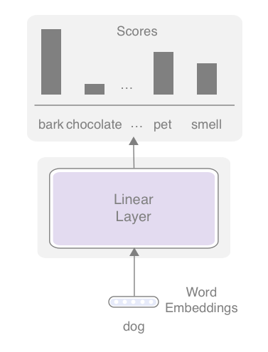
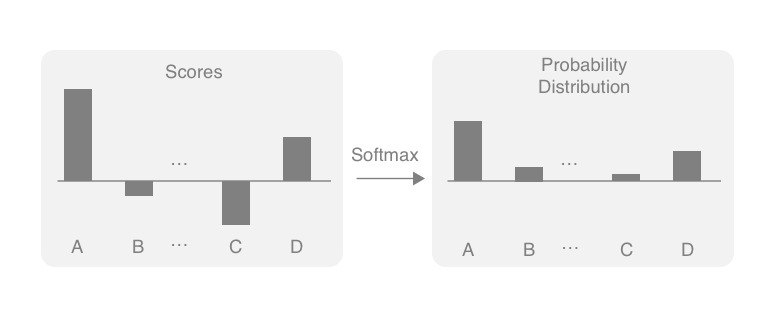
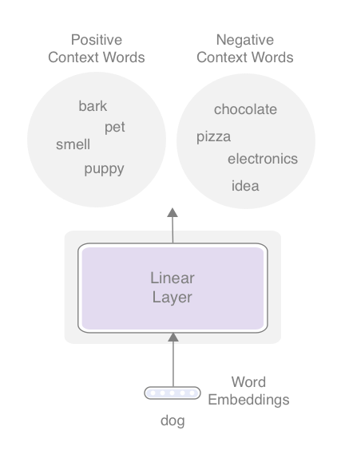

Title: A Gentle Introduction to SkipGram (word2vec) Model — AllenNLP ver.
Date: 2019-02-02 00:00
Category: Word Embeddings
Tags: Word Embeddings, word2vec, AllenNLP
Cover: example.png
slug: gentle-introduction-to-skipgram-word2vec-model-allennlp-ver

The SkipGram model (so called "word2vec") is one of the most important concepts in modern NLP, yet many people simply use [its implementation](https://code.google.com/archive/p/word2vec/) and/or pre-trained embeddings, and few people fully understand how the model is actually built. In this article, I'll cover:

* What the SkipGram model is
* How to train the SkipGram (word2vec) model from scratch
* How to evaluate the word embeddings

You can see [the full script](https://github.com/mhagiwara/realworldnlp/blob/master/examples/embeddings/word2vec.py) that I wrote for this article. The script relies on [AllenNLP](https://allennlp.org/), which makes it well-structured and readable, but none of the explanations below rely on specifics of AllenNLP. 

## What are Word Embeddings

As I explained in [the previous post](http://www.realworldnlpbook.com/blog/improving-sentiment-analyzer-using-elmo.html), a word embedding is a continuous vector representation of a word. If you are not familiar with the mathematical concept, imagine assigning an array of floating point numbers to each word: 

- `vec("dog") = [0.8, 0.3, 0.1]`
- `vec("cat") = [0.7, 0.5, 0.1]`
- `vec("pizza") = [0.1, 0.2, 0.8]`

In this example, I just made up those three-dimensional vectors, but you can see the first element of each word represents some sort of "animal-ness." If you want to calculate some semantic similarity between words, you can do it by looking at the "angle" between two vectors (more technically, this is called a *cosine similarity*). If you want to train another NLP model on top of those representations, you can use them as the input to your machine learning model. 

Now, there's one important piece of information missing from the discussion so far. How do you come up with those float numbers? It would be virtually impossible to assign them by hand. There are hundreds of thousands of unique words in a typical large corpus, and the arrays should be at least around 100-dimensional long to be effective, which means there are more than tens of millions of numbers that you need to tweak.

But more importantly, what should those numbers look like? How do you determine whether you should assign a 0.8 to the first element of the "dog" vector, or 0.7, or any other numbers? That's exactly what the SkipGram model is designed to do, which I'll explain below.

## SkipGram Model

One possible way to do this without teaching the computer what "dog" means is to use its context. For example, what words tend to appear together with the word "dog" if you look at its appearances in a large text corpus? "Pet," "tail," "smell," "bark," "puppy," ... there can be countless options. How about "cat"? Maybe "pet," "tail," "fur," "meow," "kitten," and so on. Because "dog" and "cat" have a lot in common conceptually (they are both popular pet animals with a tail, etc. etc.), these two sets of context words also have large overlap. In other words, you can guess how close two words are to each other by looking at what other words appear in the same context. This is called _the distributional hypothesis_ and has a long history in NLP.

We are now one step closer. If two words have a lot of context words in common, we can give similar vectors to those two words. You can think of a word vector as a "compressed" representation of its context words. Then the question becomes: how can you "de-compress" a word vector to obtain their context words? How can you even represent a set of context words mathematically? Conceptually, we'd like to come up with a model that does something like this: 

```text
"dog" -> (0.8, 0.3, 0.1) -> (de-compressor) -> {"pet", "tail", "smell", "bark", ...}  
``` 

One way to represent a set of words mathematically is to assign a score to each word in the vocabulary. Instead of representing context words as a set, we can think of it as an associative array from words to their "scores" that correspond to how related each word is to "dog":

```text
{"bark": 1.4, "chocolate": 0.1, ..., "pet": 1.2, ..., "smell": 0.6, ...} 
```

The only remaining piece of the model is how to come up with those "scores."  If you sort this list by word IDs (which may be assigned alphabetically), the scores can be conveniently represented by an N-dimensional vector, where N is the size of the entire vocabulary (the number of unique context words we consider). 

```text
[1.4, 0.1, ..., 1.2, ..., 0.6, ...] 
```

All the "de-compressor" needs to do is expand the word embedding vector (which has three dimensions) to another vector of N dimensions.

This may sound very familiar to some of you—yes, it's exactly what linear layers (aka fully-connected layers) do. **Linear layers convert a vector of one size to another of different size in a linear fashion.** Putting everything together, the architecture of the SkipGram model looks like the following figure:

<figure style="text-align: center">
	
	<figcaption>Figure: SkipGram model</figcaption>
</figure>

## Softmax — Converting Scores to a Probability Distribution

Hopefully I successfully convinced you that SkipGram is actually a lot simpler than most people think. Now, let's talk about how to "train" it and learn the word embeddings we want. The key here is to turn this into a classification task, where the network predicts what words appear in the context. The "context" here simply means a window of a fixed size (for example, 5+5 words on the both sides). This is actually a "fake" task because we are not interested in the prediction of the model per se, but rather in the by-product (word embeddings) produced by training the model.

It is relatively easy to make a neural network solve a classification task. You need two things:

* Modify the network so that it produces a probability distribution
* Use cross entropy as the loss function

You use something called _softmax_ to do the first. Softmax is a function that turns a vector of K float numbers to a probability distribution, by first "squashing" the numbers so that they fit a range between 0.0-1.0, and then normalizing them so that the sum equals 1. Softmax does all this while preserving the relative ordering of the input float numbers, so large input numbers still have large probability mass in the output distribution. The following figure illustrates this conceptually:

<figure style="text-align: center">
	
	<figcaption>Figure: Converting a K-dimensional real vector to a probability distribution using Softmax</figcaption>
</figure>

Cross entropy is a loss function used to measure the distance between two probability distributions. It returns zero if two distributions match exactly, and higher values if the two diverge. For classification tasks, we use cross entropy to compare:

1. the predicted probability distribution produced by the neural network (output of softmax) and,
2. the "target" probability distribution where the probability of the correct class is 1.0 and everything else is 0.0

The predictions made by the SkipGram model get closer and closer to the actual context words, and word embeddings are learned at the same time. 

## Negative Sampling — Faking the Fake Task

Theoretically, you can now build your own SkipGram model and train word embeddings. In practice, however, there is one issue in doing so—speed. Remember the softmax operation explained above first compresses scores to a range (0 to 1) and normalizes everything. This doesn't seem obvious, but if there are millions of words in the vocabulary, softmax needs to go over the list of millions of words _twice_.

Then, after computing the cross entropy loss, depending on how far the desired outcome (if the word is in the context or not) and the predicted probability for each word are, the network needs to adjust word embeddings for _every single word_ in the millions of words, even for the ones that have nothing to do with the target word and the context words. You need to run this training iteration for every single word in a large corpus. You can imagine how slow this model could be even without actually running it!

The key here is that the network tries to update word embeddings even for millions of other words that have nothing to do with the context. For example, even when you are thinking about the relationship between "dog" and "bark," the network needs to worry about updating the embeddings for, say, "pizza" and "electronics." This happens for every single word in a corpus. 

How could we make this much more efficient? The key is to consider a much smaller subset of words at a time, instead of the entire vocabulary. Specifically, in addition to the words that did appear in the context (e.g., "bark", "tail", etc.), consider a small set of randomly sampled words (e.g., "pizza", "electronics", "idea", etc.) that _did not_ appear in the context. This approach is called _negative sampling_.

Then, **the network's objective becomes a binary (not multi-class) classification task** where it distinguishes the "positive" context words from the "negative" (or, fake) context words. This is not exactly the same task as the original one (multi-class classification), but a very close one and a more efficient way to train word embeddings. The following figure illustrates this new approach.

<figure style="text-align: center">
	
	<figcaption>Figure: Negative sampling</figcaption>
</figure>

Notice that now you can ignore all the other words that are not in either the positive or the negative word sets. Updates only happen on the word embeddings for the words in those sets. The loss function becomes that of a binary classification task (sigmoid loss), but I'm not going into the details of this. See [the full code](https://github.com/mhagiwara/realworldnlp/blob/master/examples/embeddings/word2vec.py#L120) for the details. In the code, negative samples are randomly generated using Numpy's `choice` function as follows:

```python
# Generate negative examples
negative_out = np.random.choice(a=self.vocab.get_vocab_size('token_in'),
                                size=batch_size * self.neg_samples,
                                p=self.neg_sample_probs)
```

`self.neg_sample_probs` contains the pre-computed probability distribution over all the words in the vocabulary. See [the original paper](https://papers.nips.cc/paper/5021-distributed-representations-of-words-and-phrases-and-their-compositionality.pdf) for the details of this sampling procedure.

## Subsampling Frequent Words

There's one final bit of detail that you need to know before you can actually train the Skipgram model—subsampling of frequent words. 

In a typical natural language corpus, there are a small number of words that appear frequently. Often too frequently—in fact, the most common English word "the" appears 5% of time in a typical English corpus, which means, on average, one out of every 20 words in English text is "the"!

Why would this be a problem? First, frequent words are not as useful as other, less frequent words. For example, knowing "bark" appears as a context word conveys a lot more information about "dog" than knowing "the" also appears as its context word, because "the" appears in the context of almost every word in English. But more importantly, they are huge waste of computation, because "the" as a context word won't affect word embeddings very much. You can probably skip most occurrences of "the" without affecting the quality of word embeddings.

Subsampling of frequent words is inspired by this insight. The idea is that you skip occurrences of a word with a higher probability if the word occurs more frequently in the corpus. There's a specific formula used to determine this probability from the word's frequency (see [the paper](https://papers.nips.cc/paper/5021-distributed-representations-of-words-and-phrases-and-their-compositionality.pdf) for the details), but here it is probably enough to know that the higher the word's frequency in the corpus, the more likely the word is skipped. 

I implemented subsampling in AllenNLP by writing a sub-method in `DatasetReader` that specifically does this sampling. The method below, given a list of tokens in a corpus,   returns another list with rejected words replaced with `None`s (`self.reject_probs` contains a pre-computed dict of probabilities). You can simply ignore all the `None`s When you generate instances from this list.

```python
def _subsample_tokens(self, tokens):
    """Given a list of tokens, runs sub-sampling.

    Returns a new list of tokens where rejected tokens are replaced by Nones.
    """
    new_tokens = []
    for token in tokens:
        reject_prob = self.reject_probs.get(token, 0.)
        if random.random() <= reject_prob:
            new_tokens.append(None)
        else:
            new_tokens.append(token)

    return new_tokens
```

One caveat is doing this assumes that you already know the frequencies for all words that appear in a corpus. I solved this by [reading the corpus twice](https://github.com/mhagiwara/realworldnlp/blob/master/examples/embeddings/word2vec.py#L208)—first without `Vocabulary` then with. There may be smarter solutions for this, for example, lazily sampling AllenNLP's `Instance`s instead of tokens, but this is good enough for now.

## Putting Everything Together

I used the [text8 dataset](http://mattmahoney.net/dc/textdata) (a sample of cleaned Wikipedia text) as the train set. Despite all these tricks for speeding up the training, it was still slow and the model took hours to train even on a GPU, so I had to truncate the dataset by only using the first 5M tokens. Here's [the full script](https://github.com/mhagiwara/realworldnlp/blob/master/examples/embeddings/word2vec.py) I used. The batch size, the embedding size, and the number of epochs are 256, 256, and 5, respectively.

After the model is trained, you can obtain a list of similar words for a given word by computing the cosine similarity between them:

```python
def get_synonyms(token, embedding, vocab: Vocabulary, num_synonyms: int = 10):
    """Given a token, return a list of top N most similar words to the token."""
    token_id = vocab.get_token_index(token, 'token_in')
    token_vec = embedding.weight[token_id]
    cosine = CosineSimilarity(dim=0)
    sims = Counter()

    for index, token in vocab.get_index_to_token_vocabulary('token_in').items():
        sim = cosine(token_vec, embedding.weight[index]).item()
        sims[token] = sim

    return sims.most_common(num_synonyms)
```

If you run this method for the word "december", you get its list of similar words as follows:

| word      | similarity  |
|-----------|-------------|
| december  |  1.00       |
| january   |  0.58       |
| november  |  0.57       |
| july      |  0.57       |  
| october   |  0.56       |
| february  |  0.56       |
| april     |  0.55       |
| september |  0.52       |
| march     |  0.51       |
| august    |  0.50       |

The first word is the input word itself—the cosine similarity between two identical vectors is always 1.0 by definition, so this is just a sanity check. Closed classes of words that share regular structures such as numbers and months are among the easiest for word embedding models to capture, so you can use words like this to check if your embeddings are working as intended.

If you run this for "snow", you'd get:

| word      | similarity  |
|-----------|-------------|
| snow      |  1.00       |
| albedos   |  0.49       |
| nozomi    |  0.43       |
| snowstorms    |  0.42       |  
| winter    |  0.40       |
| hailstorms  |  0.40       |
| sunny     |  0.39       |
| petrel    |  0.39       |
| precipitation     |  0.38       |
| weather    |  0.39       |

The result is more mixed than the previous one, but all the word have at least something to do with snow. 

## Evaluating Word Embeddings

After trying a couple more words, you may be confident that your SkipGram model is producing word embeddings that capture at least some semantic information. But how do you objectively measure the quality of word embeddings? This is the final step in this article.

The way we'll evaluate the quality of word embeddings is to see how closely the similarities computed by embeddings (like the ones above) match the actual similarities  assigned by human judgements. I used [SimLex-999](https://fh295.github.io/simlex.html),  a dataset containing 999 word pairs and their similarities that are based on human annotations. Here's an excerpt from the dataset. The first two columns are words, and third and fourth columns are part of speech and similarity. 

```text
night   day     N       1.88
south   north   N       2.2
plane   airport N       3.65
uncle   aunt    N       5.5
horse   mare    N       8.33
bottom  top     N       0.7
friend  buddy   N       8.78
student pupil   N       9.35
world   globe   N       6.67
leg     arm     N       2.88
```

Word pairs such as "night" - "day" are given a low similarity because they are antonyms (words with opposite meanings). Other pairs, such as "leg" and "arm", are related, but also assigned low similarities. Only synonymous pairs ("student" - "pupil") are given higher similarities.

The structure of this dataset is very convenient for us. As shown above, we already have word pairs and their estimated similarity values. All you need to do is to compare two sets of  similarities and calculate how they are related. We use a correlation coefficient (more specifically, [Spearman's rank correlation coefficient](https://en.wikipedia.org/wiki/Spearman%27s_rank_correlation_coefficient)) for this.

When I ran the training, I got a correlation coefficient of r = 0.202. For reference, according to [the ACL Wiki page](https://aclweb.org/aclwiki/SimLex-999_(State_of_the_art)), the state of the art for this dataset is around 0.5. I expect that our results will be higher if we use a larger dataset and a larger value for the embedding size. 

