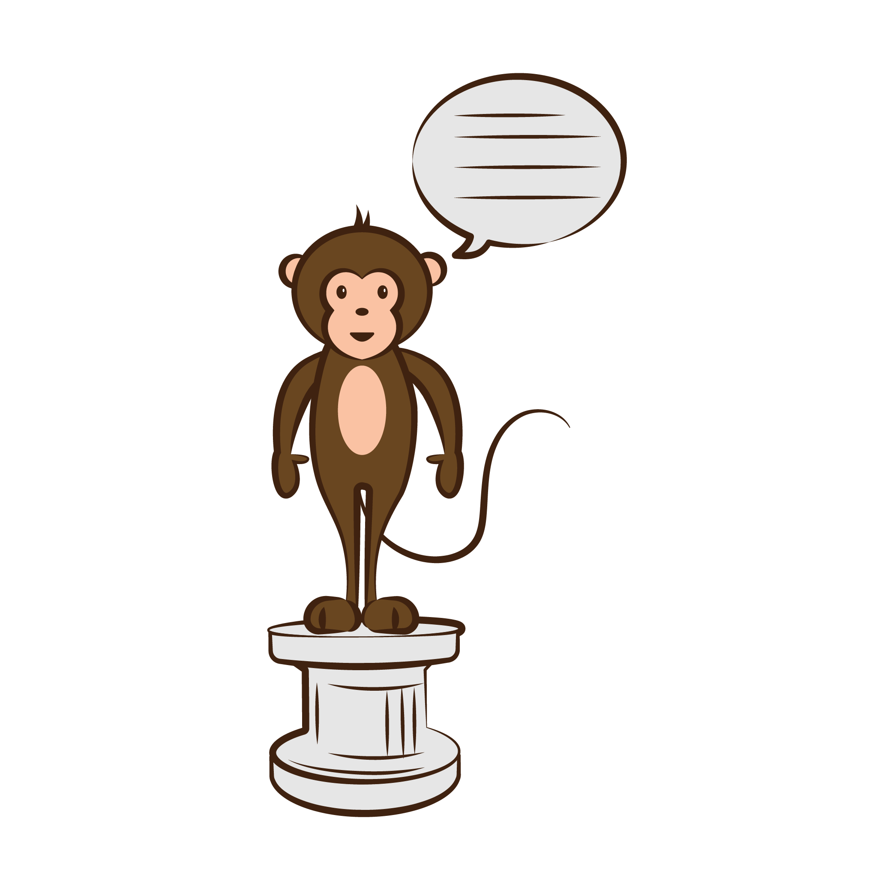
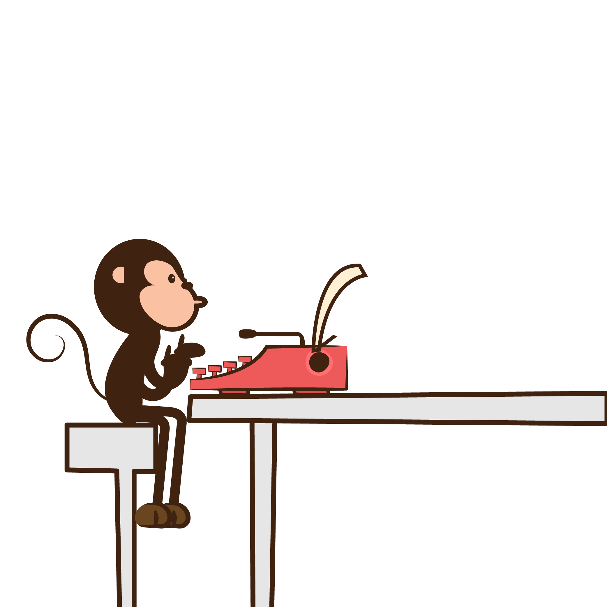
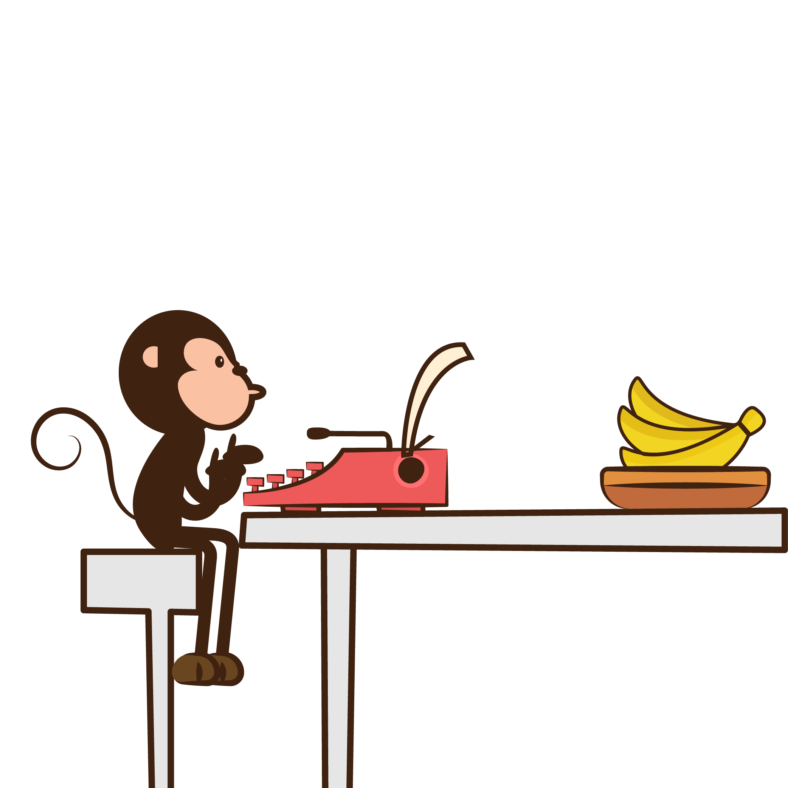
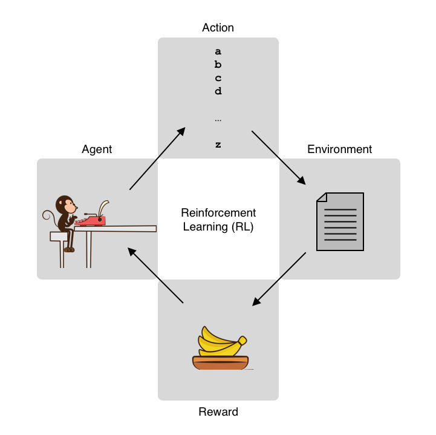
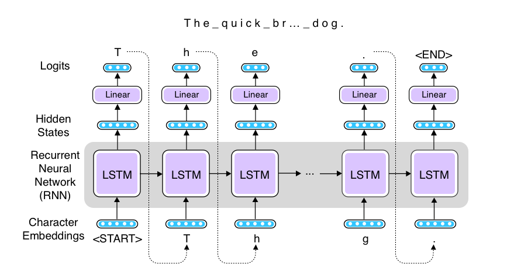
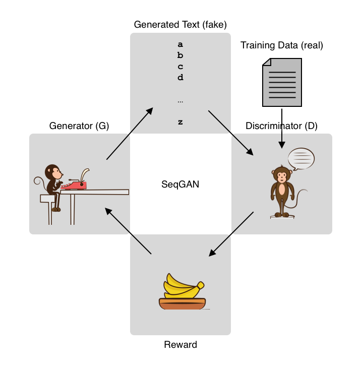

Title: Training a Shakespeare Reciting Monkey using RL and SeqGAN
Date: 2019-05-02 00:00
Category: Text Generation
Tags: Text Generation, RL, SeqGAN, AllenNLP
Cover: images/monkey-pedestal.png
slug: training-a-shakespeare-reciting-monkey-using-rl-and-seqgan

## Tackle the Monkey First

There is this article titled [Tackle the monkey first](https://blog.x.company/tackle-the-monkey-first-90fd6223e04d) written by Astro Teller, who leads Google's moonshot lab "X." The article begins "Let’s say you’re trying to teach a monkey how to recite Shakespeare while on a pedestal. How should you allocate your time and money between training the monkey and building the pedestal?"


<figure style="display: block; text-align: center;">
	
	<figcaption>Monkey reciting Shakespeare on a pedestal</figcaption>
</figure>

The moral of the story is that you should spend zero time building the pedestal and focus on the most difficult part, which is training the Shakespeare reciting monkey, although many people tend to rush off and start building the pedestal instead just to have a sense of progress and to have at least something to show to their boss. A Shakespeare reciting monkey without a pedestal is still an incredible achievement, while a pedestal is just a pedestal without the monkey.

I love this article—I can't remember how many times I was tempted to "build the pedestal" first when I had choices between projects or some components and I realized I was about to do something easier instead of tackling the most difficult part. Re-reading this article almost always helps me go back on track. "When in doubt, do something more difficult." is one of my life mottoes. In fact, I liked this article so much that now I write "tackle the monkey first" at the top of my to-do list to constantly remind me of the most important thing every day (and I thank an ex-coworker of mine at Duolingo for sharing this wonderful article).

So, I decided to tackle the monkey first. 

## Infinite Monkey Theorem

<figure style="display: block; text-align: center;">
	
	<figcaption>Monkey at a typewriter</figcaption>
</figure>

I don't know where Astro Teller got the inspiration of Shakespeare reciting monkeys, but the concept is not entirely new. In mathematics and probability theory, there's a famous thought experiment called "Infinite Monkey Theorem," which states that a monkey sitting at a typewriter hitting keys at random will eventually produce the complete works of Shakespeare, such as the entire text of Hamlet, purely by chance given an infinite amount of time. 

This is somewhat counter-intuitive, but there's a nice explanation on [the Wikipedia page](https://en.wikipedia.org/wiki/Infinite_monkey_theorem) on why this is the case, so we can borrow it here—suppose there are 50 keys on the typewriter and the monkey is pressing the keys uniformly and independently. The chance of this monkey accidentally producing a word "banana" is 1/50 to the sixths power, which is less than one in 15 billion. Let this probability be p. 

Now, let's think about giving this monkey a second chance. The chance of this monkey producing the word "banana" within two trials is 1 - (1 - p)^2, which is about one in 8 billion. Still extremely small likelihood, but not zero, and it increases as the number of trials increases. After one million trials, this probability is about 0.9999, and after ten billion, it is about 0.5273. The probability 1 - (1 - p)^n asymptotically reaches 1.0 as n gets bigger. This informally proves that a monkey hitting random keys will eventually produce a word "banana" purely by chance.

But we are not just talking about producing a single word—it's about producing the entire work of Shakespeare. For example, there are about 130,000 characters in Hamlet. The probability of a monkey producing the entire text of Hamlet by chance after the first trial is one in 3.4 x 10^183,946, according to the Wikipedia page. To get a feel of how small this probability is, let's quote a paragraph from there—

> Even if every proton in the observable universe were a monkey with a typewriter, typing from the Big Bang until the end of the universe (when protons might no longer exist), they would still need a still far greater amount of time – more than three hundred and sixty thousand orders of magnitude longer – to have even a 1 in 10^500 chance of success.

This is a bit discouraging—in theory, a typewriter-hitting monkey will produce Hamlet at some point, but in practice, none of us can afford a universe full of monkeys nor billions of years. If it takes a universe full of monkeys more than billions of years to have an even slightest chance of reciting Shakespeare, it is understandable that you would rather be building the pedestal instead. 

## Training Monkeys

But if you think of it, a monkey hitting typewriter keys uniformly and independently may be an interesting mathematical device, but not a realistic one. Researchers found that certain types of monkeys, especially chimpanzees, are highly intelligent. You can probably train the monkey so that they have a higher chance of reproducing Shakespeare before you wait till the end of the universe.

For example, in English text, the letter E appears a lot more frequently than, say, the letter Z does. If you want to reproduce Hamlet, for example, hitting the E key more often than other letters is a good strategy. If you can teach this simple bias over the distribution of English letters to the monkey (let's call him George), he will have a far greater chance of reciting Shakespeare.

<figure style="display: block; text-align: center;">
	
	<figcaption>Monkey at a typewriter with bananas</figcaption>
</figure>

And here's the tool that many animal trainers agree is useful—rewards. You can reinforce George's positive behavior by giving him some bananas. Specifically, when the text George produced resembles Shakespeare's work, you'll give him some bananas. The more it looks like Shakespeare's work, the more bananas he'll be rewarded with. On the other hand, when he produces some garbage that doesn't look anything from Shakespeare, he'll get no bananas. George has very little idea what he's done right or wrong, but if you keep doing this long enough, you expect that he'll figure out how he should be typing in order to get more rewards, and what he produces will start to look like Shakespeare's work.

## Reinforcement Learning (RL)

In machine learning, this framework is called Reinforcement Learning (RL). There are many good courses, books, and Internet articles that you can refer to to learn RL, so in what follows I'll only briefly describe some core concepts.

<figure style="display: block; text-align: center;">
	
	<figcaption>Reinforcement Learning (RL)</figcaption>
</figure>

There is an agent (= George the monkey) in an environment. The agent takes some actions (= typing keys) based on its state (= what George's thinking), and is given some rewards (= bananas) depending on the outcome (= produced text). The goal here is to optimize the actions of the agent so that it can maximize the future expected rewards.

Specifically, we are going to use one family of reinforcement learning algorithms called policy gradient. In policy gradient, the policy (what actions the agent should take in a particular state) is explicitly modeled and optimized. We'll be using one particular type of policy gradient algorithm called REINFORCE, which uses Monte-Carlo methods to estimate the expected rewards, although we are not going in to the details of the algorithm in this post.

## Implementing a Shakespeare reciting monkey

In order to train the Shakespeare reciting monkey, I'm going to use a recurrent neural network (RNN), namely, an LSTM RNN, to build a text generation system. As a general framework, an RNN receives a vector, updates its internal states, and produces another vector at a timestep. The output vector is then fed into a linear layer to expand (or shrink) it to another vector, from which predictions are made.

Since we are simulating a monkey typing a typewriter, we generate and feed individual characters to the RNN. Even whitespaces and punctuations are treated as individual "tokens." But as with typical language generation models, there is no actual "input," so we feed the generated character at the previous timestep as the input to the next timestep. The length of the output vector is the same as the number of all the alphabets we consider. The following figure illustrates the architecture.


<figure style="display: block; text-align: center;">
	
	<figcaption>Text generation using RNN</figcaption>
</figure>

I implemented this RNN language generation model as follows. It's a (somewhat weird) mix of AllenNLP and PyTorch, but hopefully it's not terribly difficult to read. 

```python
class RNNLanguageModel(Model):
    def __init__(self, vocab: Vocabulary) -> None:
        super().__init__(vocab)

        token_embedding = Embedding(num_embeddings=vocab.get_vocab_size('tokens'),
                                    embedding_dim=EMBEDDING_SIZE)
        self.embedder = BasicTextFieldEmbedder({"tokens": token_embedding})

        self.rnn = PytorchSeq2SeqWrapper(
            torch.nn.LSTM(EMBEDDING_SIZE, HIDDEN_SIZE, batch_first=True))

        self.hidden2out = torch.nn.Linear(in_features=self.rnn.get_output_dim(),
                                          out_features=vocab.get_vocab_size('tokens'))


    def generate(self, max_len: int) -> Tuple[List[str], Tensor]:

        start_symbol_idx = self.vocab.get_token_index(START_SYMBOL, 'tokens')
        end_symbol_idx = self.vocab.get_token_index(END_SYMBOL, 'tokens')

        log_likelihood = 0.
        words = []
        state = (torch.zeros(1, 1, HIDDEN_SIZE), torch.zeros(1, 1, HIDDEN_SIZE))

        word_idx = start_symbol_idx

        for i in range(max_len):
            tokens = torch.tensor([[word_idx]])

            embeddings = self.embedder({'tokens': tokens})
            output, state = self.rnn._module(embeddings, state)
            output = self.hidden2out(output)

            log_prob = torch.log_softmax(output[0, 0], dim=0)
            dist = torch.exp(log_prob)

            word_idx = torch.multinomial(
                dist, num_samples=1, replacement=False).item()

            log_likelihood += log_prob[word_idx]

            if word_idx == end_symbol_idx:
                break

            words.append(self.vocab.get_token_from_index(word_idx, 'tokens'))

        return words, log_likelihood
```

After computing the logits (`output`) by applying the linear layer, they are converted to a probability distribution (by applying `log_softmax` then `exp`), from which the next word is sampled by `multinomial`. 

Make sure that the generate function returns the log likelihood of the generated text. We will need it later. The log likelihood of the sequence is simply the sum of log of individual probabilities (which you already calculated by `log_softmax` above).

Now, how do we calculate the reward? There could be a million different ways to do this, but I chose to use one of my favorite metrics for textual similarity, [chrF](https://aclweb.org/anthology/W15-3049). chrF is simply the F-measure of character n-grams between the prediction and the reference. The more similar these two are, the higher the value will be. The code below random samples 100 lines from the training set (Shakespeare's *Hamlet*), calculates [the chrF metric using NLTK](https://www.nltk.org/_modules/nltk/translate/chrf_score.html) between the generated text and each sampled line, and returns the average: 

```python 

def calculate_reward(generated: str, train_set: List[str], num_lines=100) -> float:
    line_ids = np.random.choice(len(train_set), size=num_lines)

    chrf_total = 0.
    for line_id in line_ids:
        line = train_set[line_id]
        chrf = sentence_chrf(line, generated, min_len=2, max_len=6, beta=1.,
                             ignore_whitespace=False)

        chrf_total += chrf

    return chrf_total / num_lines
```

Finally, here's the key to reinforcement learning: in order to encourage positive behavior, you optimize the LSTM RNN to maximize the log likelihood, but you scale this value by the reward you just calculated. It's like a self-reinforcement loop, but this only happens when the reward is large. If the reward is large, the network is adjusted so that it will repeat the similar behavior next time around. If it's small, little adjustment happens. George the monkey has little idea what he did right or wrong, but because he gets some bananas, he'll just try to increase the probability of all the actions he just took. This is called the credit assignment problem in reinforcement learning.
 
This is equivalent to using the negative log likelihood scaled by the reward as the loss function:

```
loss = -1. * reward * log_likelihood
``` 
 
The following is the simplified training step (one epoch) using this loss function:

```python
model.zero_grad()

log_likelihoods = []
rewards = []

for _ in range(BATCH_SIZE):
    words, log_likelihood = model.generate(max_len=60)
    reward = calculate_reward(''.join(words), train_set)

    log_likelihoods.append(log_likelihood)
    rewards.append(reward)

baseline = sum(rewards) / BATCH_SIZE
avr_loss = sum(-1. * (reward - baseline) * log_likelihood
               for reward, log_likelihood in zip(rewards, log_likelihoods))
avr_loss /= num_instances

avr_loss.backward()
optimizer.step()
```

Note that I used a baseline (`baseline` in the code) which is defined as the average of batch rewards and is subtracted from individual rewards. This is a common technique used to stabilize the RL training. You can see the entire script from [the Github repository from here](https://github.com/mhagiwara/realworldnlp/blob/master/examples/generation/rl.py).

When you run this, at first "George" is generating utterly random texts as follows (the numbers next to each line is the reward): 

```text
epoch: 0, loss: 0.05585931986570358, avr_reward: 0.0017550825254028862
    sNi!bnPTzG,lEzHwSwHNTEJkVmaOoypREZ!XaDsilXaPnpKmkFn.fWFMFtTE           0.002
    aFExDxNjloFxIUwanN's vhm,PoUIpUENIIPErN FDQf                           0.006
    ICzmqKHaKrJGQvu!FAnpBksicaYJBLNOD,xdSE,TvELyPZIB!xGZmmAsXsgg           0.001
    FtV oVGMxxCsksEmnvR?'WWTCESMYgbb,brSPrsJgUtuFzV.nUosofaix?Pw           0.004
    yPqUIx!mh.yMjp.iglxmeHqwruNwxJFKIkqWbpzDjvvygHKUv'VReeCdcfV!           0.002
    LbvWfPdpYd                                                             0.000
    eXMUkjLOADX!kBXyz                                                      0.000
    xC',myEr'hMkfBfw.wiOl,GhHYbx'sdEnNggMnhzFTjWEXFqJnKRWF xP,mZ           0.002
    W,TA,YhXDcmgNOHp,tZ GXE,e.ZaVBsTT.gcrc?ShnNePGirtQDqXC                 0.001
    gqltaWgqTdAyR dv                                                       0.002
```

But at around epoch 20, he learns how to use whitespace to separate "words:"
```text
epoch: 20, loss: 0.18826496601104736, avr_reward: 0.02756517726360421
    JsmXi,r  H h s sni e  msnta ni   , ddo tre  so ii  . nrieo e           0.028
    hISe wti en eroosea do o  s s ass d o aso  it n ,atse     d            0.036
    qR?lJ  oatiio  ost    nisantltPrl o aisist   ?es  o ooue et            0.026
    D,,fAoiedii  o  t  hso  e   d  ensihi  ee   dTe l ., oaq it            0.027
    !'HUr  oninass em t et  . oo    l  srhk  sts   i e t el yhd            0.034
    HTdTfo eu sdstr arh   a . ehh ir a hnensno hTk sonrrean h              0.026
    OFezjlhgttsnt   sta ttsssd  hoes  t e t dd n    o  t s?iU Im           0.027
    'CT.pQeh e .aona  o  tdi  nshteeo t es    n s heh t  dl   hh           0.028
    KZ bZebilstnt o  o do iteoth sqdoro  s s    i ynd yt   de he           0.036
    Ab!V trto  ntdhtso  er   ryni   nteeh  si dte  a g h   does            0.026
```

At epoch 100, the distribution of characters looks a lot like that of real English:
```text
epoch: 100, loss: 0.00019525864627212286, avr_reward: 0.0367961233153457
    il e n tih  taah  tti  h sat toe e eeea eetr s saihhao tnrrt           0.029
    .oea ttrhee rn erit t  do s  th tstat hohrersr   s te   ns             0.045
    tiohoereeae  r thant sae  hs   e r thht t ttr a   e tt h   t           0.037
    ZV trs ahntr t e  tn r e  atoa ne he shts rdrh    oe na t  e           0.034
     uneh h  s ttet hs tto  ttort thest    et s snte rr e    edt           0.035
    !eaae  iarsns sh  etd tr  neitehn neh  ohest  eoasstn os  o            0.032
    pYaath s a t a  hhthentst he h  ratanat e he o ttt n tseh oa           0.040
    Fosrr nieseaht   a eeen asn  e  t e hteat rs r  tahe t hethr           0.036
    nnsee a  td oh ithtese ts tta t eh noo ahea aarhn hia oett n           0.040
    fhthaaa t ttt an d ohs as a hs eeottiaahttaen  tethss t nees           0.035
```

At epoch 499 (the final epoch), many words look a lot like real English ones:
```text
epoch: 499, loss: -0.002016159240156412, avr_reward: 0.06706022209882276
    o it s the on the, ther eo there to and to it is to anm then           0.066
    l me here the o, is in mere, there s as tor at se s, on io t           0.072
    h to here t ther iand mer ans ot ind as the ther to as ind t           0.069
    an the at or in there or ho and ther me then so s the on the           0.074
    n no at the ato herere  nd, is ato is tot the hor at there t           0.058
    , is the in tot it ther me on to there the s, ind s, atd at            0.071
    ereat t tor to her there is to here as to at to and there in           0.064
    o ann or there at is the ond ind the ot there therer and and           0.072
     se mor, tor ther the mer the ine and as it on, to ther ler            0.070
    ho s tor and ind an ns and the the s there on se ther hen, o           0.069
```

This is not a bad result for such a short and simple program, although the generated text is far from that of Shakespeare. Under this environment and the definition of rewards, the best strategy for George to maximize the expected reward is to generate a lot of common English words, such as "the" and "and" and "is." But this does not guarantee that the generated text looks like real English. 

This is also a common phenomenon when using ML (maximum likelihood) for optimization. Such models tend to produce something close to the "average" that is not interesting nor realistic. 
 
## SeqGAN — using Generative Adversarial Network (GAN)

Maybe the way we defined the reward was not right. We should reward pieces of text that look like real English, not just "average" ones. But how should we go about doing this? How would we determine if a given piece of text looks like real English?

Easy—use machine learning! 

The concept here is quite simple. Instead of calculating the reward using some heuristics, have another machine learning model do it. This is like having another monkey (let's call her Doxie) do "supervision" on what George has produced. George generates text, while Doxie classifies it (or discriminates it), so they are called Generator (G) and Discriminator (D), respectively.

_Doxie the discriminator_'s job is to receive texts from real Shakespeare's work (`real` instances) and also from George's (`fake` instances), and to tell the two apart. If she's successful in discriminating these two classes of text, she's given some rewards—bananas. So she gets better and better at this.

On the other hand, you reward _George the generator_ based on how successful he was in making Doxie believe what he produced is real Shakespeare's work. How many bananas he gets is therefore how much Doxie thinks George's work is Shakespeare's. So he also gets better and better at this. 

This is the basic idea of GANs (Generative Adversarial Networks). Notice these two monkeys are in an adversarial relationship. One's interest is negatively associated with the other's. These two models compete with each other and get better and better at their own jobs. As a result, we expect the generator gets better and better at generating realistic text. See the following figure for an illustration.

<figure style="display: block; text-align: center;">
	
	<figcaption>Text generation using SeqGAN</figcaption>
</figure>

Also notice that we have made little change to George the Generator. We still train him using bananas and reinforcement learning. On the other hand, Dixie the discriminator is trained using the usual supervised training paradigm, because we know which piece of text is real or fake. This is the core idea of SeqGAN, a GAN model for training sequence generation. 

The SeqGAN algorithm described in [the original paper](https://arxiv.org/abs/1609.05473) does more than this, for example, using MC search to estimate the expected reward for intermediate states and actions. What I describe in the following is a simplified version of the algorithm, where only complete sequences get rewards and used for updates.

## Implementing SeqGAN

First, let's implement the discriminator (D). As mentioned above, its job is simply to classify real texts from fake ones, and you can use your favorite text classification model, as long as they produce probabilities. Following the paper, I implemented D using a CNN (convolutional neural network) using AllenNLP as follows:

```python
class Discriminator(Model):
    def __init__(self,
                 embedder: TextFieldEmbedder,
                 embedding_size: int,
                 num_filters: int,
                 vocab: Vocabulary) -> None:
        super().__init__(vocab)
        self.embedder = embedder

        self.encoder = CnnEncoder(embedding_size, num_filters=num_filters)

        self.linear = torch.nn.Linear(in_features=self.encoder.get_output_dim(),
                                      out_features=vocab.get_vocab_size('labels'))

        self.loss_function = torch.nn.CrossEntropyLoss()

    def forward(self,
                tokens: Dict[str, torch.Tensor],
                label: torch.Tensor = None) -> Dict[str, torch.Tensor]:
        mask = get_text_field_mask(tokens)

        embeddings = self.embedder(tokens)
        encoder_out = self.encoder(embeddings, mask)
        logits = self.linear(encoder_out)

        output = {"logits": logits}
        output["loss"] = self.loss_function(logits, label)

        return output
``` 

In order to calculate the reward, you simply run this discriminator model on an instance and return the probability for the `real` class, as in:

```python
def get_reward(instance: Instance,
               discriminator: Discriminator,
               vocab: Vocabulary) -> float:

    logits = discriminator.forward_on_instance(instance)['logits']
    probs = np.exp(logits) / sum(np.exp(logits))  # softmax

    real_label_id = vocab.get_token_index('real', 'labels')
    return probs[real_label_id]
```

Finally, the simplified training step (one epoch) looks like this:

```python
# train generator
generator.zero_grad()

instances = get_generator_batch(
	generator, token_indexers, args.batch_size)

log_likelihoods = []
rewards = []

for instance, log_likelihood in instances:
	reward = get_reward(instance, discriminator, vocab)
	rewards.append(reward)
	log_likelihoods.append(log_likelihood)

baseline = sum(rewards) / len(instances)
avr_loss = sum(-1. * (reward - baseline) * log_likelihood
			   for reward, log_likelihood in zip(rewards, log_likelihoods))
avr_loss /= len(instances)

avr_loss.backward()
generator_optim.step()

# train discriminator
for d_step in range(args.d_steps):
	instances = get_discriminator_batch(
		generator, train_set, token_indexers, args.batch_size)

	iterator = BasicIterator(batch_size=2 * args.batch_size)
	iterator.index_with(vocab)

	trainer = Trainer(model=discriminator,
					  optimizer=discriminator_optim,
					  iterator=iterator,
					  train_dataset=instances,
					  num_epochs=args.d_epochs)
	trainer.train()
```

The first half of this code looks almost exactly the same as the one above for RL, but with different rewards. The second half of this code runs the training loop for the discriminator for `d_steps` times. According to the original paper, this improves the discriminator and stabilizes the SeqGAN training. You can see [the full code from here](https://github.com/mhagiwara/realworldnlp/blob/master/examples/generation/seqgan.py).

When I ran this, George the Generator was generating something like this at epoch 0. Note that the generated samples are not as bad as the ones from the RL experiment at epoch 0. This is because I pre-trained the generator using maximum likelihood based on the algorithm described in the paper: 

```text
epoch: 0, loss: 3.657949447631836, avr_reward: 0.3042039595849708
    Yank meoe.                                                             0.053
    Ke inrdhas shisd?                                                      0.088
    Fhes ar ha to coalherses wifat, Hhiaw rothel-                          0.388
    fo thiero Hord                                                         0.230
    Out ruut highanp                                                       0.284
    Wome Flwipe nith wimadt 'ne Thor? Pubparref.                           0.495
    Tham. rarteas gop Kaleen it, pintut ne roy fag oong? pimnt ane'bn      0.459
    gaver I fhe llom.                                                      0.617
    seos the sevge iind,                                                   0.101
    at. Ewo ue Fpot Qhwled fo mauut lame!'nn alp. iof lov'd'to             0.675
```

Note that the quality of what he produces fluctuates significantly from epochs to epochs.  

```text
epoch: 20, loss: -0.2615254521369934, avr_reward: 0.09727548112901777
    T,n, answ? B?,,,,                                                      0.179
    HofsanhrkangharhroF'angas!,, fharimzade                                0.038
    narsangvraloreipTourtlr hrhoun,                                        0.329
    ,e wan! Pygo heeO Ypawhr, PoswororisbagLaa,rorsagha, 'gy,rgirwinh      0.077
    Qnergua,,,yatighichanouganigolfrar, awhy oureI,                        0.193
    ainTonwoura, givcososhy,                                               0.032
    EEsit his,,areougharasrar                                              0.090
    Laued, Nawheny ioriworeryzay fh henpho?w'rywowosdisen, Aftrhonwin      0.041
    yrWisawsawinonghacrurparhashiande,                                     0.208
    ro mer,y,,,                                                            0.038
```

At around epoch 50, he seems to have almost forgotten how to type whitespaces:
```text
epoch: 51, loss: -0.29897576570510864, avr_reward: 0.11309156971025479
    KmeeoreeseolleeVthimeomeumeeephadtoumhesadenamerimlrouseele omath      0.037
    gape mftonqouleshewilooche omo aeneeth PamOSowCee e uledogoveocee      0.038
    Hiphepulesloe mocelume eefewhityomathpeiue pelt oulheCeee iolimet      0.044
    Gpury ceutaceekteleepou@@UNKNOWN@@opeereeeeyoienetheet oulbopitible hosopow 0.063
    Fobeokocoumshepopeetherithee couethoneuheogusopourecomppfike oume      0.033
    hooule Sowe houdoreonouniekime uohaao oNichithethplethiwecetfeceo      0.036
    AiteowenlemepoeTeoWhomoe outoutI.khe uipOutedceyesTome lost orore      0.034
    I, Ioset ometulise mowrenoditrouOtheme ket te homireSheaeethesipo      0.044
    liroke bosoomoe oxuwtuaudoamve heleI outgTokielari ouamermlisaime      0.091
    antei go namavefme etXixeesoe oomuvelonam horitopoekomsoousemosey      0.072
``` 

After about 100 epochs, the training stabilizes a bit:

```text
epoch: 105, loss: -0.12946881353855133, avr_reward: 0.15411285912377126
    the conf sinthiss the costosRar.t heisdes, Lould, thit                 0.172
    Vosed soonne jet, soH th'y. me thesg. cetthet pay thtooctht me ha      0.128
    Qfe bot at thothe Oens tos, tard, ame betkd chentasd thy haf thet      0.192
    em thesstecat und thed mowe.ttertof thinsd wam iftet be head and       0.082
    med, lo, AeNtbht perthel the se, moVths gan? oustite tap,y. at..       0.054
    ie motcy the as cot wongtthosre theb cothet nut housd be we cesth      0.258
    thelle do porycWat toree'g thf he bit be beruthe bede he con, che      0.866
    thets che centetthercye bee the mut phet horos soune cond mthesth      0.070
    the Pesist'the nentough watust oud he Ie fithannnthitey Ged he co      0.050
    sdime Rett be the fes he,rothethe se we wenthe sf than hepsithl i      0.211
```

Here are some more cherry-picked interesting-looking examples generated by SeqGAN:
```text
he the thoutesthe whesthey ofeevesthe peesthare.
Ass he min, whe he the Onthe O se of mal. antle me Dite ghet ob t
hest he goute, anss henog ye the bocCank'de then. esde thes that,
The tot thensee hasy hfgrre te owd, worty ibe the sofed and be pm
he the he chasf coas se ke r in, fors to ased bif the 'fy an, se
```

These sentences still do not make any sense and look nothing like Shakespeare, but the distribution of the characters and also the lengths of the words is pretty close to English. Indeed, the "invented" words by George actually do look and sound like real English words: "whesthey," "antle," "goute," "hasy," etc. These sentences read almost like [the Jabberwocky poem](https://en.wikipedia.org/wiki/Jabberwocky) from Through the Looking Glass.

I haven't run full parameter search for this, but my experience with (this simplified) SeqGAN is it is extremely brittle and difficult to train. It is widely known that GANs are tricky to train, but SeqGAN is even more so. There is [a nice collection of tips when training SeqGAN by Surag Nair](https://github.com/suragnair/seqGAN). According to this, "Stability is extremely sensitive to almost every parameter :/" and I fully agree!

One trick I found useful to stabilize SeqGAN was to combine the RL reward heuristics I used for the first half of this post with the GAN objective. People also suggest combining the maximum likelihood objective with GAN's (MIXER by Ranzato et al. 2016). There's a lot more to experiment! 

That's it for now. Most of the progress of this post is made during my mini-batch week at [the Recurse Center](https://www.recurse.com/). I'm really grateful for the people there for running such a wonderful program. 
