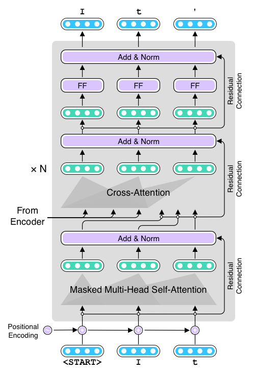

Title: The Unreasonable Effectiveness of the Transformer Spell Checker
Date: 2020-06-18 00:00
Category: Spell Checker
Tags: Transformer, fairseq
Cover: images/monkey-pedestal.png
slug: unreasonable-effectiveness-of-transformer-spell-checker

<figure style="display: block; text-align: center;">
	
	<figcaption>xfspell — the Transformer Spell Checker</figcaption>
</figure>

NOTE: All the code and pre-trained model necessary for running this spell checker can be found in [the xfspell repository](https://github.com/mhagiwara/xfspell). 

In the modern world, spell checkers are everywhere. Chances are your web browser is equipped with a spell checker which tells you when you make a spelling mistake by underlining wrong words. Many word processors and editors also run spell checkers by default. Some applications (including Google Docs and Microsoft Word) even point out simple grammatical errors too. Ever wondered how they work? We'll learn how to formulate this as an NLP problem, prepare the dataset, train, and improve the model below. 

## Spell Correction as Machine Translation

Spell checkers receive a piece of text such as: "tisimptant too spll chck ths dcment," detect spelling and grammatical errors if any, and fix all errors: "It's important to spell check this document." How can you solve this task with NLP technologies? How can such systems be implemented? 

The simplest thing you could do is to tokenize the input text into words, and check if each word is in a dictionary. If it's not, you look for the closest valid word in the dictionary according to some measure such as the edit distance and replace with that word. You repeat this until there are no words left to fix. This word-by-word fixing algorithm is widely used by many spell checkers due to its simplicity.

However, it has several issues. First, just like the first word in the example "tisimptant," how do you know which part of the sentence is actually a word? The default spell checker for my Microsoft Word, for example, indicates it's a misspell of "disputant," although it would be obvious to any English speakers that it is actually a misspell of two (or more) words. The fact that users can also misspell punctuation (including whitespace) makes everything very complicated. Second, just because some word is in a dictionary doesn't mean it's not an error. For example, the second word in the example, "too" is a misspell of "to," but both are valid words that are in any English dictionary. How can you tell if the former is wrong in this context? Third, all these decisions are made out of context. One of the spell checkers I tried shows "thus" as a candidate to replace "ths" in this example. However, from this context (before a noun) it is obvious that "this" is a more appropriate candidate, although both "this" and "thus" are one edit distance away from "ths," meaning they are equally valid options according to the edit distance. 

You would be able to solve some of these issues by adding some heuristic rules. For example, "too" is more likely a misspell of "to" before a verb, and "this" is more likely before a noun than "thus," etc. But this is obviously not scalable. Language is vast and full of exceptions. You cannot just keep writing such rules to deal with the full complexity of language. Even if you are able to write rules for such simple words, how would you tell that "tisimptant" is actually two words? Would you try to split this word at every possible position to see if split words resemble existing words? What if the input was in a language that is written without even whitespace, like Chinese and Japanese?

At this point, you may realize this "split and fix" approach is going nowhere. Do spell checkers resemble any NLP tasks you have worked on before? Because they take a piece of text as the input and produce the fixed string, it'd be most straightforward if we solved this as a Seq2Seq task. In other words, it can be thought of as some sort of a machine translation system that translates noisy inputs with spelling/grammatical errors into clean, error-free outputs. You can regard these two sides as two different "languages" (or "dialects" of English).

<figure style="display: block; text-align: center;">
	
	<figcaption>Spell checking as machine translation</figcaption>
</figure>

We will use the Transformer as our main Seq2Seq model and [fairseq](https://github.com/pytorch/fairseq) as our main library of choice. We won't cover the basics of the Transformer in this article, but if you are interested in learning more, [check out my book](https://www.manning.com/books/real-world-natural-language-processing)—it has a detailed chapter on the Transformer, which will be published soon.

At this point, you may be wondering where we are obtaining the dataset. This is often the most important (and the most difficult) part in solving real-world NLP problems. Fortunately, there's a public dataset we can use for this task. Let's dive in and start building a spell checker.


## Training a Spell Checker
 
 We will be using [GitHub Typo Corpus](https://github.com/mhagiwara/github-typo-corpus) as the dataset to train a spell checker. The dataset, created by my collaborator and me, consists of hundreds of thousands of "typo" edits automatically harvested from GitHub. It is the largest dataset of spelling mistakes and their corrections to date, which makes it a perfect choice for training a spell checker.

One decision we need to make before preparing the dataset and training a model is what to use as the atomic linguistic unit on which the model operates. Many NLP models use tokens as the smallest unit (that is, RNN/Transformer is fed a sequence of tokens), while a growing number of NLP models use word or sentence pieces as the basic units (I'm planning on dedicating one section of my book to this topic). What should we use as the smallest unit for spell correction? As with many other NLP models, using words as the input sounds like good "default" thing to do at first. However, as we've seen above, the concept of tokens is not well suited for spell correction—users can mess up with punctuation, which makes everything overly complex if you are dealing with tokens. More importantly, because NLP models need to operate on a fixed vocabulary, this would mean that the spell corrector vocabulary needs to include every single misspelling of every single word it encountered during the training. This would make it unnecessarily expensive to train and maintain such an NLP model.

For these reasons, we will be using _characters_ as the basic unit for our spell checker. Using characters has several advantages—this can keep the size of the vocabulary quite small (usually less than hundred for a language with a small set of alphabets such as English). You don't need to worry about bloating your vocabulary even with a noisy dataset full of typos, because typos are just different arrangements of characters. You can also treat punctuation marks (even whitespace) as one of the "alphabets" in the vocabulary. This makes the preprocessing step extremely easy, because you don't need any linguistic toolkit (such as tokenizers) for doing this.

Note that using characters is not without disadvantages. One main issue is using them will increase the length of sequences, because you need to break everything up to characters. This makes the model large and slower to train.

First, let's prepare the dataset for training a spell checker. All the necessary data and code for building a spell checker is included in [the xfspell repository](https://github.com/mhagiwara/xfspell). The tokenized and split datasets are located under `data/gtc` (as `train.tok.fr`, `train.tok.en`, `dev.tok.fr`, and `dev.tok.en`). The suffixes `en` and `fr` are a commonly used convention in machine translation—"fr" means "foreign language" (it used to mean "French") and "en" means English, because many MT research projects were originally (and still are) motivated by people wanting to translate some foreign language into English. Here, we are using "fr" and "en" to mean just "noisy text before spelling correction" and "clean text after spelling correction."

<figure style="display: block; text-align: center;">
	
	<figcaption>Excerpt from GitHub Typo Corpus</figcaption>
</figure>

The figure above shows an excerpt from the dataset for spelling correction created from GitHub Typo Corpus. Notice that text is segmented into individual characters, even whitespaces (replaced by "_"). Any characters outside common alphabets (upper and lower case letters, numbers, and some common punctuation marks) are replaced with "#." You can see that the dataset contains very diverse corrections, including simple typos (pubilc -> public on line 670, HYML -> HTML on line 672) and more trickier errors (mxnet as not -> mxnet is not on line 681, 22th -> 22nd on line 682), and even lines without any corrections (line 676). This looks like a good resource to use for training a spell checker.

The first step for training a spell checker (or any other Seq2Seq models) is preprocess the datasets. Because the dataset is already split and formatted, all you need to do is run `fairseq-preprocess` to convert the datasets into a binary format:

```bash
fairseq-preprocess --source-lang fr --target-lang en \
    --trainpref data/gtc/train.tok \
    --validpref data/gtc/dev.tok \
    --destdir bin/gtc
```

Then you can start training your model right away:

```bash
fairseq-train \
    bin/gtc \
    --fp16 \
    --arch transformer \
    --encoder-layers 6 --decoder-layers 6 \
    --encoder-embed-dim 1024 --decoder-embed-dim 1024 \
    --encoder-ffn-embed-dim 4096 --decoder-ffn-embed-dim 4096 \
    --encoder-attention-heads 16 --decoder-attention-heads 16 \
    --share-decoder-input-output-embed \
    --optimizer adam --adam-betas '(0.9, 0.997)' --adam-eps 1e-09 --clip-norm 25.0 \
    --lr 1e-4 --lr-scheduler inverse_sqrt --warmup-updates 16000 \
    --dropout 0.1 --attention-dropout 0.1 --activation-dropout 0.1 \
    --weight-decay 0.00025 \
    --criterion label_smoothed_cross_entropy --label-smoothing 0.2 \
    --max-tokens 4096 \
    --save-dir models/gtc01 \
    --max-epoch 40
```

Note that this might not even run on your laptop. You really need GPUs to train the Transformer models. Also note that training can take hours even with GPU(s). 

You don't need to worry about most of the hyperparameters here—this is the set of parameters that worked fairly well for me, although some other combinations of parameters can work better. However, you may want to pay attention to some of the parameters related to the size of the model, namely:

* Number of layers (`--[encoder|decoder]-layers`)
* Embedding dimension of self-attention (`--[encoder|decoder]-embed-dim`)
* Embedding dimension of feed-forward layers (`--[encoder/decoder]-ffn-embed-dim`)
* Number of attention heads (`--[encoder|decoder]-attention-heads`)

These parameters determine the capacity of the model. In general, the larger these parameters are, the larger capacity the model would have, although as the result the model also requires more data, time, and GPU resources to train. Another important parameter is `--max-tokens`, which specifies the number of tokens loaded onto a single batch. If you are experiencing out-of-memory errors on a GPU, try adjusting this parameter.

After the training is finished, you can run the following command to make predictions using the trained model:

```bash
echo "tisimptant too spll chck ths dcment." \
    | python src/tokenize.py \
    | fairseq-interactive bin/gtc \
    --path models/gtc01/checkpoint_best.pt \
    --source-lang fr --target-lang en --beam 10 \
    | python src/format_fairseq_output.py
```

Because the `fairseq-interactive` interface can also take source text from the standard input, we are directly providing the text using the echo command. The Python script `src/format_fairseq_output.py`, as its name suggests, formats the output from `fairseq-interactive` and shows the predicted target text. When I ran this, I got:

```
tisimplement too spll chck ths dcment.
```

This is rather disappointing. The spell checker learned to somehow fix "imptant" to "implement," although it failed to correct any other words. I suspect there are a couple of reasons for this. The training data used, GitHub Typo Corpus, is heavily biased towards software-related language and corrections, which might have led to the wrong correction (imptant -> implement). Also, the training data might have just been too small for the Transformer to be effective. How could we improve the model so that it can fix spellings more accurately? 

## Improving a Spell Checker

As we discussed above, one main reason why the spell checker is not working as expected might be because the model wasn't exposed to a more diverse, larger amount of misspellings during training. But as far as I know there are no such large datasets of diverse misspellings publicly available for training a general-domain spell checker. Then, how could we obtain more data for training a better spell checker?

This is where we need to be creative. One idea here is to artificially generate noisy text from clean text. If you think of it, it is very difficult (especially for a machine learning model) to fix misspellings, while it is very easy to "corrupt" clean text to simulate how people make typos, even for a computer. For example, we can take some clean text (which is available from, for example, scraped web text almost indefinitely) and replace some letters at random. If you pair artificially-generated noisy text created this way with the original, clean text, this will effectively create a new, larger dataset on which you can train an even better spell checker!

The remaining issue we need to address is how to "corrupt" clean text to generate realistic spelling errors that look like the ones made by humans. You can write a Python script that, for example, replaces, deletes, and/or swaps letters at random, although there is no guarantee that typos made this way are similar to those made by humans and the resulting artificial dataset provides useful insights for the Transformer model. How can we model the fact that, for example, humans are more likely to type "too" in place of "to" than we do "two?"

This is starting to sound familiar again. We can use the data to simulate the typos! But how? This is where we need to be creative again—if you "flip" the direction of the original dataset we used to train the spell checker, you can observe how humans make typos. If you treat the clean text as the source language while the noisy text as the target and train a Seq2Seq model for that direction, you are effectively training a "spell corruptor"—a Seq2Seq model that inserts realistic looking spelling errors into clean text. See the following figure for an illustration.
 
 <figure style="display: block; text-align: center;">
	
	<figcaption>Using back-translation to generate artificial noisy data</figcaption>
</figure>

This technique of using the "inverse" of the original training data to artificially generate a large amount of data in the source language from a real corpus in the target language is called _back-translation_ in the machine translation literature. It is a very common, popular technique to improve the quality of machine translation systems. If you are interested in learning more, check out some related papers (for example, [Ednov et al. 2018](https://arxiv.org/abs/1808.09381)). As we'll show below, it is also very effective for improving the quality of spell checkers.

You can easily train a spell corruptor just by swapping the source and the target languages. You can do this by supplying "en" (clean text) as the source language and "fr" (noisy text) as the target language when you run `fairseq-preprocess` as follows:

```bash
fairseq-preprocess --source-lang en --target-lang fr \
    --trainpref data/gtc/train.tok \
    --validpref data/gtc/dev.tok \
    --destdir bin/gtc-en2fr
```

We are not going over the training process again—you can use almost the same `fairseq-train` command to start the training. Just don't forget to specify a different directory for `--save-dir`. After you finish training, you can check whether the spelling corrupter can indeed corrupt the input text as expected:

```bash
$ echo 'The quick brown fox jumps over the lazy dog.' | python src/tokenize.py \ 
    | fairseq-interactive \
    bin/gtc-en2fr \
    --path models/gtc-en2fr/checkpoint_best.pt \
    --source-lang en --target-lang fr \
    --beam 1 --sampling --sampling-topk 10 \
    | python src/format_fairseq_output.py
The quink brown fox jumps ove-rthe lazy dog.
```

Note the extra options that I added above (`--beam 1 --sampling --sampling-topk 10`). It means that the `fairseq-interactive` command uses sampling (from top 10 tokens with largest probabilities) instead of beam search. When corrupting clean text, it is often better to use sampling instead of beam search. To recap, sampling picks the next token randomly according to the probability distribution after the softmax layer, while beam search tries to find the "best path" that maximizes the score of the output sequence. Although beam search can find better solutions when translating some text, we want noisy, more diverse output when corrupting clean text. Past research (Ednov et al. 2018) has also shown that sampling (instead of beam search) works better for augmenting data via back-translation.

From here, the sky's the limit. You can collect as much clean text as you want, generate noisy text from it using the corruptor you just trained, and increase the size of the training data. There is no guarantee that the artificial errors look like the real ones made by humans, but this is not a big deal because 1) the source (noisy) side is only used for encoding and 2) the target (clean) side data is always “real” data written by humans, from which the Transformer can learn how to generate real text. The more text data you collect, the more confident the model will get about what error-free, real text looks like.

I won't go over every step I took to increase the size of the data, but here's the summary of what I did and what you can also do (see [the bash script that contains everything I ran](https://github.com/mhagiwara/xfspell/blob/master/src/run_bt.sh) if you are interested in reproducing). Collect as much clean and diverse text data from publicly available datasets, such as [Tatoeba](https://tatoeba.org/) and [Wikipedia dumps](https://dumps.wikimedia.org/). My favorite way to do this is to use [OpenWebTextCorpus](https://skylion007.github.io/OpenWebTextCorpus/), an open source project to replicate the dataset on which GPT-2 was originally trained. It consists of a huge amount (40GB) of high-quality Web text crawled from all outbound links from Reddit. Because the entire dataset would take days, if not weeks, just to preprocess and run the corruptor on, you can take a subset (say, 1/1000th) and add it to the dataset. I took 1/100th of the dataset, preprocessed it, and ran the corruptor to obtain the noisy-clean parallel dataset. This 1/100th subset alone added more than 5 million pairs (in comparison, the original training set only contains ~240k pairs). Instead of training from scratch, you can download the pre-trained weights and [try the spell checker from the repository](https://github.com/mhagiwara/xfspell).

The training took several days even on multiple GPUs, but when it's done, the result was very encouraging. Not only can it accurately fix spelling errors:

```
$ echo "tisimptant too spll chck ths dcment." \
    | python src/tokenize.py \
    | fairseq-interactive \
    bin/gtc-bt512-owt1k-upper \
    --path models/bt05/checkpoint_best.pt \
    --source-lang fr --target-lang en --beam 10 \
   | python src/format_fairseq_output.py
It's important to spell check this document.
```

But the spell checker also appears to understand the grammar of English to some degree:

```
$ echo "The book wer about NLP." |
    | python src/tokenize.py \
    | fairseq-interactive \
   ...
The book was about NLP.

$ echo "The books wer about NLP." |
    | python src/tokenize.py \
    | fairseq-interactive \
   ...
The books were about NLP.
```

This example alone may not prove that the model really understands the grammar (namely, using the correct verb depending on the number of the subject). It might just be learning some association between consecutive words, which can be achieved by any statistical NLP models, such as n-gram language models. However, even after you make the sentences more complicated, the spell checker shows amazing resilience:

```bash
$ echo "The book Tom and Jerry put on the yellow desk yesterday wer about NLP." |
    | python src/tokenize.py \
    | fairseq-interactive \
   ...
The book Tom and Jerry put on the yellow desk yesterday was about NLP.

$ echo "The books Tom and Jerry put on the yellow desk yesterday wer about NLP." |
    | python src/tokenize.py \
    | fairseq-interactive \
   ...
The books Tom and Jerry put on the yellow desk yesterday were about NLP.
```

From these examples, it is clear that the model learned how to ignore irrelevant noun phrases (such as "Tom and Jerry" and "yellow desk") and focus on the noun ("book(s)") that determines the form of the verb ("was" versus "were"). We are more confident that it understands the basic sentence structure. All we did was collect a large amount of clean text and trained the Transformer model on it, combined with the original training data and the corruptor. Hopefully through these experiments you were able to feel how powerful the Transformer model can be!

Finally, I ran some more quantitative analysis on the quality of the Transformer spell checker. I used [the CLC FCE Dataset](https://ilexir.co.uk/datasets/index.html), a corpus of English text written by ESOL learners and only extracted spelling mistakes. I ran [Aspell](http://aspell.net/), the Transformer model trained only on the GitHub Typo Corpus (GTC), and the full Transformer Spell Checker trained on 7m+ parallel pairs.   

| Model   | Precision   | Recall      |   F0.5    |
| ---     | ---         |  ---        |   ---     |
| Aspell  | 0.638       | 0.706       |  0.651    |
| Transformer (GTC) | 0.246 | 0.384 | 0.265 |
| Transformer (full) | 0.655 | 0.836 | 0.684 |

We used precision, recall, and F0.5 measure as the evaluation metrics. F0.5 (which puts a higher weight on precision) is a common metric used for evaluating spell checking and grammatical error correction systems. Note that from this table the full Transformer model seems is just barely better than Aspell, but this is because the FCE dataset is written in British English and the Transformer accidentally "corrects" many British spelling to American English.   

Finally, we note that the use of the Transformer + back-translation for spelling correction and grammatical error correction (GEC) is nothing new. There is a lot of interesting work done for GEC. Check out [(Kiyono et al. 2019)](https://arxiv.org/abs/1909.00502) and [(Grundkiewicz et al. 2019)](https://www.aclweb.org/anthology/W19-4427/) if you are interested in the latest development in this field.
